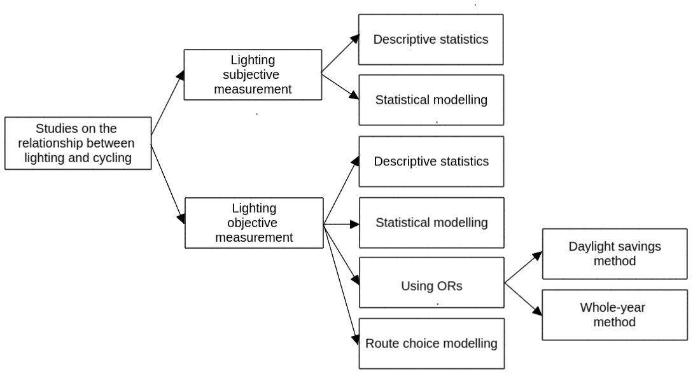

<!-- Alternative title:
- Road lighting and cycling uptake
- Ambient light, lighting, and cycling rates -->

**Abstract**

<Background>Many studies have explored the extent to which the built environment (e.g. population density, land use mix, proximity, spatial connectivity) and especially safe cycling infrastructure affects cycling uptake.
Less attention has been paid to the impact that micro-environmental factors such as road lighting may have on people's choice to cycle.
This paper provides a review of the scientific literature on the relationship between road lighting and cycling uptake and identifies existing gaps in research and knowledge.
<Method>We used a hybrid systematic and snowballing method.
TBC empirical studies were reviewed. 
These studies can be divided into those that use subjective measurements and those that use objective measurements.
<Results>Most of the studies analysed suggest that road lighting has a strong positive effect on cycling levels during the night. The impact is higher among women.
More research on the effect of road lighting specifically on cycling is needed, including in developing countries, in countries with extreme latitudes, and on the different impact that road lighting has on cyclists of different ages and social groups. 
<Conclusion>

<!-- To what extent darkness or lack of road lighting deter people from cycling? -->

<!-- Linear cycling infrastructure at ground level, such as cycle lanes, have received the bulk of research and policy attention in relation to investment in cycling.  -->
<!-- However, localised treatments such as appropriate lighting and cycle parking can have a major impact on cyclability.  -->
<!-- There is evidence suggesting darkness discourages people from cycling, and increases the risk of being involved in a collision whilst cycling.  -->
<!-- Appropriate road or path lighting can increase feelings of reassurance, make hazards more visible, and make the cyclist more visible to other road users.  -->
<!-- However, there is to date little evidence on the lighting interventions that work best, in combination with other measures.  -->
<!-- Lighting after dark has costs, both in terms of energy use and harmful ecological effects due to excess light pollution, raising the question: what is the optimal use of lighting to enable safe cycling uptake, at all times and in all seasons? -->

**Keywords** 

Cycling; road lighting; road safety; personal security; inequalities

# Introduction

Benefits of cycling are well established in the literature.
Cycling improves physical, mental, and social health; reduces pollution, carbon emissions, and congestion; and it is more inclusive than private motorised modes, reducing inequalities [@oja_health_2011]. 
For this reason, cycling is encouraged. Still, cycling levels are low in most cities.

Many studies have explored the extent to which the built environment (e.g. population density, land use mix, proximity, spatial connectivity) and especially safe cycling infrastructure affects cycling uptake.
However, less investigated have been micro-built environmental factors such as road lighting, which may have a strong influence on people choice to cycle. 

<!-- Previous research has found a positive association between street lighting and physical activity (PA) and active travel (AT) [@prince_examining_2022; @bonaccorsi_impact_2020]. -->

There is evidence suggesting that darkness discourages people from cycling (e.g...). 
This is due to a higher perceived danger of cyclists at night from motorised traffic and crime and personal security, which disproportionately affect women, the elderly, and disadvantaged groups [@schneider_perceived_2022]. 

<!-- Mention the rest of literature review fond in the search? -->

Previous academic literature reviews have touched on elements of the relationship between cycling and lighting.
For example, @fotios_lighting_2017 reviewed suggested interventions to enable cycling lighting to contribute to the safety of cyclists in the UK. 
@reynolds_impact_2009 reviewed the impact of transport infrastructure, including street lighting, on cycling collisions.
However, to the best of our knowledge, no academic paper has reviewed the international literature available on the relationship between road lighting and cycling uptake.
This paper aims to fill this gap in the literature.

<!-- The review is guided by the following questions: -->

<!-- 1.  To what extent does darkness influence cycling behaviour? -->

<!-- 2.  To what extent does darkness increase the risk of being a victim of crime among cyclists? -->

<!-- 3.  Is the association between cycling and darkness the same between different groups? -->

We focus on road lighting, excluding studies on lighting equipment for cyclists, such as reflective clothing or bicycle-mounted lights.

The review is organized as follows.
Section 2 describes the method.
Section 3 presents the findings of the papers reviewed.
Section 4 critically analyses the findings and identifies gaps in the literature.
Section 5 closes the work with the conclusions.

# Method

## Search strategy

We used a hybrid systematic and snowballing method.
First, we searched two electronic databases, SCOPUS and Web of Science (WOS) (on 6 January 2023), for empirical studies investigating the relationship between cycling and road lighting, 
All searches were based on the content of the title, abstract, and keywords, and the query string used for the search was as follows:

*(bicycl\* OR bik\* OR cycling OR cyclist\* OR "cycle hire") AND ("city light\*" OR "public light\*" OR "road light\*" OR "street light\*" or "city illumination" OR "public illumination" OR "road illumination" OR "street illumination" OR "city lamp\*" OR "public lamp\*" OR "road lamp\*" OR "street lamp\*" OR "lamp post\*" OR "light post\*" OR "light pole\*")* 

This search resulted in 262 records in SCOPUS and 206 in WOS. After combining search results, excluding duplicates, and screening abstracts and full texts, TBC studies were selected.
We excluded papers that did not focus on cycling and road lighting (many studies mentioned cycling and lighting in passing but not as the topic of the paper).
We also excluded the papers referring to how light influenced not cycling uptake but the road safety of cyclists.

Second, we checked the references from the studies selected (i.e. snowball technique), and after screening abstracts and full texts, TBC additional papers were selected.
In total, TBC were reviewed.
A flow chart of the search strategy is shown in Figure 1.

```{r fig1, echo=FALSE, fig.align="center", fig.cap="Figure 1: flow chart", out.width = '50%'}
knitr::include_graphics("flow-chart.png")
```

<!-- Paper we did not have access: -->

<!-- - S. Chandra, R. Radhakrishnan, Street visibility-dependent path finding for pedestrians and bicyclists in urban areas, Transportation Research Board 94th Annual Meeting, Transportation Research Board, Washington DC, United States, 2015. -->

## Data extraction

The following information was extracted from each study: author(s) and year, location of study, measurements for cycling and lighting, type of measurements, method or analytical tool, and results (Table 1). 
<!-- For analytical reasons, the type of measurements were classified into subjective and objective, depending on whether the associations were perceived (subjective) or objectively measured (objective). -->

# Results

## Trends of research

The scientific literature was found to be broadly spread across several disciplines, including engineering, public health, urban design/planning and transport planning.

Most of the studies were written in the last decade, with 2022 being the year in which the most studies on this topic were published (Figure 1).

```{r fig2, eval=FALSE, fig.cap="Figure 2: Number of studies reviewed", message=FALSE, warning=FALSE, include=FALSE}
library(kableExtra)
library(tidyverse)

papers <- read.csv("lrp-papers-summary.csv")

df = papers %>% replace(is.na(.), 0) %>%
  filter(road_light == 1) %>% 
  group_by(year) %>% 
  summarise(number = n())

x_axis_labels <- min(df[,"year"]):max(df[,"year"])

ggplot(df, aes(x = year, y = number)) +
  geom_bar(stat="identity") +
  labs(x ="", y="Number of studies reviewed") +
  scale_y_continuous(breaks= c(0, 2, 4, 6, 8, 10)) +
  scale_x_continuous(labels = x_axis_labels, breaks = x_axis_labels) +
  theme_minimal() +
  theme(axis.text.x = element_text(angle = 90, vjust = 0.5, hjust=1)) 
```

## Types of studies 

<!-- 

- Objective and subjective research

- Exploratory, Descriptive, and Explanatory research

-->

Studies looking at the association between road lighting and cycling uptake can be divided between those that used subjective measurements and objective measurements.

Correlational research studies and Descriptive research studies.

<!-- "Subjective measures of reassurance are prone to stimulus range bias and socially desirable responding, and, as stated preferences, it is unknown whether they are reflected in behaviour (revealed preference). -->
<!-- A more direct approach to investigating whether road lighting influence cycling is to count the number of people using these transport modes in different light conditions. If darkness reduces reassurance, then there will be fewer pedestrians and cyclists. This has been investigated, and confirmed, in studies taking advantage of variation in daylight, either the seasonal variation or the sudden transition imposed by biannual daylight saving clock changes" [@fotios_extending_2022]. Objective measures of behaviour provide stronger evidence. -->

<!-- Range bias in evaluations of perceived safety [@fotios_specifying_2016]. -->

<!-- "The daylight savings method of analysis better isolates changes in weather from the effects of ambient light on travel choice than does the whole-year method" [@fotios_whole-year_2019]. -->

```{r fig3, eval=FALSE, fig.align="center", fig.cap="Figure 2: Study types", include=FALSE}

```

## Empirical findings

The odds of cycling participation and duration was not higher in participants who agreed that streets were well lit [@castillo-paredes_perceived_2022].

Perception of poor light at night was not significantly associated with people who reported traffic safety or personal security barriers to cycling [@schneider_perceived_2022].

"Both traffic safety concerns and personal security concerns were most strongly associated with poor neighborhood opportunities for exercise. 
Respondents living in lower-income communities reported greater barriers to pedestrian and bicycle safety and security than residents from wealthier neighborhoods" [@schneider_perceived_2022].

Using Strava Heatmap data and spatial regression models, @yang_crowdsourced_2022 found street lighting positively associated with running, but not with cycling. 

<!-- Using odd ratios to compare traffic flows in case and control hours, @fotios_effect_2022 found that darkness had a significant negative effect on the number of pedestrians and cyclists, but not on the number of motorized vehicles. -->

Using satellite and street view imagery and linear regressions, @zacharias_environmental_2021 found street lighting highly significantly associated with higher uptake and deposit of dock-less shared bicycle trips.

Using odd ratios, @uttley_road_2020 found that the drop in cycling levels after dark was substantially greater in unlit locations, compared with lit locations. @uttley_road_2020 also found a non-linear relationship between relative brightness and the reduction in cyclists after-dark, suggesting that a minimal amount of lighting could be enough to promote cycling after dark.

@fotios_whole-year_2019 found that "ambient light has a significant impact: For a given time of day, more people walk or cycle when it is daylight than after dark and more people cycle on cycle trails and walk on foot paths after dark when they are lit than when they are unlit".

<!-- This supported previous work which "indicated the numbers of pedestrians and cyclists during the case period were significantly higher during daylight conditions than after-dark, resulting in a 62% increase in pedestrians and a 38% increase in cyclists" [@uttley_using_2017]. -->

"Some bicyclists favor routes which are planted with street trees or installed with street lights" [@chen_gps_2018].

In a paper that estimated welfare change associated with improvements in urban bicycling facilities, @poorfakhraei_estimating_2015 found that "cycle tracks were valued the most, followed by street lighting, and bicycle lanes".

<!-- "@winters_motivators_2011 found that a major deterrent to cycling was if the route was not well lit after-dark. The deterrent effect was largest for people who don’t currently cycle but potentially would do in the future, highlighting the importance of lighting in encouraging uptake of cycling" [@uttley_road_2020].  -->

[@sanders_all_2013]

Respondents in a study that examined if neighbourhood environments were associated with walking and cycling, reported that good lighting at night is an important facilitator of cycling [@lee_neighbourhood_2008].

<!-- "Nightfall was more of a deterrent to bicycling than walking" [@cervero_walking_2003].  -->

"The presence of street lighting increased the likelihood of daily cycling in < 75 years old females and rural females but not in other subgroups." [@van_cauwenberg_physical_2012].

"Children whose routes had a high density of streetlights were less likely to cycle to school" [@panter_neighborhood_2010].

<!-- ## Cycling, crime, and lighting -->

<!-- "Variables related to crime and lighting of public spaces were associated with active travel in countries in Latin America" [@castillo-paredes_perceived_2022]. -->

<!-- @lusk_bicycle_2019 asked lower-income predominantly-minority residents what bicycle routes surface or context they perceived as safest from crime and crashes. They reported that "clean signs, balconies, cafes, street lights, no cuts between buildings, and flowers were low risk for crime and witnesses, little traffic, and bike signals low risk for crash".  -->

<!-- "Violent crimes appear to significantly deter people from choosing to walk or bicycle, potentially exposing themselves to threats of personal injury" [@appleyard_influence_2017]. -->

<!-- "High-crime neighborhoods tend to discourage residents from walking or riding a bicycle" [@ferrell_influences_2012]. -->

<!-- @cervero_travel_1997 "suggested that the presence of road lighting and the distance between lamps were significant aspects of neighbourhood design that contributed to encouraging non-automobile travel". -->

<!-- ## Cycling inequalities in lighting -->

<!-- Fear of danger of injury from traffic, falls, or violence seems to affect groups differently. -->

<!-- <Gender> -->

<!-- @fotios_extending_2022 found that darkness has a greater deterrent effect on female cyclists than on male cyclists.  -->

<!-- "Recent research [@sustrans_bikelife_2018] found that only 23% of women felt safe cycling during hours of darkness, compared with 36% of men, which suggests that Lighting may also contribute to addressing the current gender imbalance in cycling by encouraging more women to cycle after-dark" [@uttley_road_2020]. -->

<!-- "Women are less likely to cycle to work in the dark, so women are more sensitive to the absence of daylight" [@heinen_day_2011]. -->

<!-- "Darkness was also more important to women than to men, but with a mean grading of 3.0 in the survey of 1998, and 2.7 in the survey of 2000, this factor could still not, not even for women, be considered to be important in the choice of mode" [@bergstrom_potential_2003]. -->

<!-- "Women are more sensitive to dark spaces when walking and cycling than men" [@xie_i_2018]. -->

<!-- <Disadvantaged groups> -->

<!-- "The dominant deterrents to bicycle commuting are unpleasant weather and inadequate daylight" [@stinson_frequency_2004] -->

```{r tab4, echo=FALSE, message=FALSE, warning=FALSE}
library(kableExtra)
library(tidyverse)

papers <- read.csv("lrp-papers-summary.csv")

df = papers %>%
  filter(road_light == 1) %>% 
  
  select(authors, location, cycling, lighting, measurement_types, analytical_tool, result)

kbl(df,
    caption = "Table 1: Overview of studies that have examined the association between road lighting and cycling uptake") %>%
    kable_styling()
```

# Discussion

#### To what extent does road lighting influence cycling uptake?

The positive results obtained in studies looking at the association between cycling uptake and street lighting show the importance of light conditions as a policy measure to encourage cycling in the dark. 
Lighting conditions improvements not only may increase cycling trips in general, but also the inclusivity of cycling, since, as has been demonstrated, street lighting will benefit more certain groups such as women.

#### What are the possible causes of this positive relationship?

Road lighting help cyclists at night to visualize their route in the dark (allowing obstacles and trip hazards to be seen and avoided). 
It makes cyclists feel more visible and less at risk of being hit by motorised traffic during their journeys at night. 
Also, it provides them with a greater sense of security against possible threats in the dark.

Another factor that explains why there is less cycling at night is the fear of crime. 
This is much less investigated than the relationship between lighting and cycling collisions.
There is evidence that street lighting decreases crime and enhances reassurance and confidence of pedestrians and cyclists after dark [e.g. @castillo-paredes_perceived_2022].

#### Is the association between road lighting and cycling uptake the same between different groups?

@van_cauwenberg_physical_2012 found that "presence of street lighting increased the likelihood of daily cycling in < 75 years old females and rural females, but not in other subgroups".
@fotios_extending_2022 found that the deterrent of darkness for cycling was greater for females than for males. 
@heinen_day_2011 found that women are less likely to cycle to work in the dark.

#### What type of road lighting is the most suitable for cycling to increase and be safer?

Studies used different measurements for road lighting, without specifying the type or levels of lighting.
Find out the most suitable, environmentally friendly and "green" solution to fulfill the cyclists road lighting requirements. 

[@fotios_lighting_2017]

## Research gaps

Based on these findings, we highlight the following research needs:

- More focus on the effect of road lighting specifically on cycling. 
Many studies look at road lighting and physical activity and active travel, failing to separate walking and cycling. 
The characteristics of environments encouraging walking may be different from those supporting cycling. 

- More research in developing countries. 
"Lack of street lighting can contribute to poor visibility, perception and fear of crime thus decreasing bicycle use. This is particularly relevant in  Sub-Saharan Africa due to the generalized lack of security and safety" [@mendiate_cycling_2022].

- More research in extreme latitude locations, which have longer durations of darkness during parts of the year.

- Deeper understanding on how road lighting affects different cyclist groups. 
Also gender-age groups are under-research. Do young female perceive cycling in the dark more dangerous than other women-age groups due to the risk of sexual assault?

- More research on the reasons why road lighting is important for cyclists. Which of the possible reasons has more weight? Because it helps them to visualize their route in the dark? 
To make them feel more visible and less at risk of being hit? 
Or to make them feel safer from being a victim of crime? 
Answers to these questions may help to adopt different policies to reduce the impact of darkness on cycling levels.

- Further research is needed on the specific type of road lighting appropriate for cyclists. 

<!-- -   Lack of research in developing countries -->

## Strenghts and limitations

<Strength>This paper provides a review of the scientific literature on the relationship between road lighting and cycling uptake and identifies existing gaps in research and knowledge. 
To the best of our knowledge, no papers had looked at this association and gaps in the literature before.
<Limitations>Nevertheless, the paper has several limitations. 
Although we used a hybrid systematic and snowballing search method to avoid missing existing studies, we could have been more strict by using more than one electronic database.
We do not include and analyse the controls used in each of the studies.

# Conclusions

This paper reviewed published research on the intersection between road lighting and cycling uptake.

<gaps>Despite the recent growth of articles on this subject, it is still under-researched. More empirical work in the area of cycling and road lighting is needed.

<!-- The review presented above highlights the need for more empirical work in the area of cycling uptake (which means tackling the barriers to cycling including road safety and perceived personal safety) and lighting.  -->

<!-- We plan to undertake some of this work over the coming months in the SATURN (Supporting Active Travel Using Road lighting at Night) project, which has been funded by the UK Research and Innovation body.  -->

<!-- During the project we plan to  measure change in cycling levels, primarily through cyclists counts, and cycling safety due to darkness as inferred from models of cycling levels and high resolution casualty over multi year timescales and in a number of different locations.  -->

<!-- Comparing resulting estimates of change in cycling and safety levels will help assess the impact of lighting in those locations, but there is much else to do in this field beyond what is possible in a 24 month research project.  -->

<!-- Further work is needed to better understand how lighting characteristics such as illuminance and the spatial distribution of lighting influence cycling rates and cyclist safety.  -->

<!-- To ensure the policy relevance of future work into road lighting and cycling, it is important that the findings feed into larger models of cycling uptake to support cost effective investment in road and path lighting (Fotios et al., 2017), as part of balanced packages of interventions, for the benefit of people who stand to benefit from better walking, cycling and wheeling provision worldwide. -->

# Disclosure statement

No potential conflict of interest was reported by the author(s).

# References