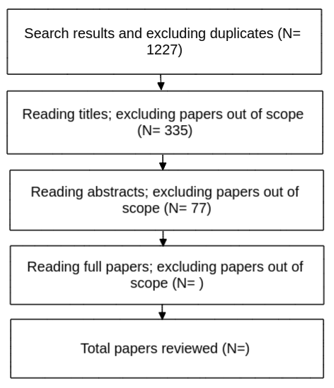

# Abstract

Background: A large body of evidence shows that darkness discourages people from walking and cycling.
This can be explained by the fear of pedestrians and cyclists to suffer some type of damage from motorised traffic, a fall, or some type of violence.
This may disproportionately affect women, the elderly, and disadvantaged groups.

Aim: This paper provides a review on the scientific literature that intersects between active travel and road lighting to better understand the relationship between both factors.

Method: We used a hybrid systematic and snowballing method.
TBC studies on several disciplines such as transportation, public health, road safety, criminology, social inequalities, and engineering and technology were reviewed.

Results: The literature suggests that...
Gaps in the literature are...

Conclusion:

# Introduction

Benefits of active travel are well established in the literature.
Active travel (i.e. walking, cycling, and wheeling) improves physical, mental, and social health; reduces pollution, carbon emissions, and congestion; and it is more inclusive than private motorised modes, reducing inequalities.

Many variables (individual, social, and environmental) can affect an individual's decision to travel by active modes, including by walking, wheeling (meaning by non-powered mobility devices, scotters and other wheeled human powered vehicles), and cycling.
Darkness is one of the environmental factors that most affect walking.
It also seems to affect cycling, although there are fewer studies on the influence of darkness on cycling. As described later, there is practically no research regarding wheeling and darkness although we can assume that darkness is a major barrier to wheeling because people who rely on wheeled mobility are among the most vulnerable in society^[The annual [Disability & Cycling](https://wheelsforwellbeing.org.uk/wp-content/uploads/2022/05/Disability-and-Cycling-Report-of-2021-national-survey-results.pdf) report by the charity Wheels for Wellbeing, for example, highlights the importance of mobility and active modes for disabled people.
The report states that cycling provides a sense of protection for those whose disability renders them visible and vulnerable when on foot" but does not discuss the impacts of darkness or lighting on feelings of vulnerability, reflecting gaps in the academic literature.].

Previous academic literature reviews have touched on elements of the relationship between active travel and lighting.
@cerin_neighbourhood_2017 reviewed literature on the relationship between physical environment and active travel in general; @cozens_critical_2003 explored papers on the association between street lighting and crime or fear of crime; @boyce_benefits_2019 reviewed research into the benefits of light at night for perceptions of safety; and @fotios_lighting_2017 reviewed suggested interventions to enable cycling lighting to contribute to the safety of cyclists in the UK.

```{=html}
<!-- Reviews on the relationship between build environment and active travel or physical activity considering lighting (e.g. @bonaccorsi_impact_2020; @mccormack_search_2011; @cerin_neighbourhood_2017; @prince_examining_2022).
Other reviews look at environment, crime, and physical activity (e.g. @foster_built_2008; @loukaitou-sideris_is_2006), or at street lighting and crime [@cozens_critical_2003]. 
@boyce_benefits_2019 wrote a review on the benefits of light at night in general. 
@fotios_lighting_2017 provide a review of suggested actions to enable cycling lighting to contribute to the safety of cyclists. However, they focus only on cycling and in the UK.
There are also a few reviews on appropriate road lighting [@fotios_light_2005; @fotios_s_road_2010; @fotios_specifying_2016]. -->
```

This paper aims to fill this gap in the literature, reviewing published research specifically focussed at the intersection between active travel and road lighting.

The review is guided by the following questions:

1.  To what extent does darkness influence active travel behaviour?

2.  To what extent does darkness increase the risk of road collision among active travellers?

3.  To what extent does darkness increase the risk of being a victim of crime among active travellers?

4.  Is the association between active travel and darkness the same between different groups?

5.  What type of road lighting is the most suitable for active travel to increase and be safer?

We focus on road and/or ambient lighting, excluding studies on lighting equipment for pedestrians or cyclists, such as reflective clothing or bicycle-mounted lights.

The review is organized as follows.
Section 2 describes the method.
Section 3 presents the findings of the papers reviewed.
Section 4 critically analyses the findings and identifies gaps in the literature.
Section 5 closes the work with the conclusions.

# Method

<!-- ## Search strategy -->

We used a hybrid systematic and snowballing method.
First, we searched in the SCOPUS electronic databased (on 11 Oct 2022) for studies investigating the relationship between active travel and road lighting.
We searched for papers from 2000 to present.
The query string used for the search was as follows:

*walk\* OR foot OR pedestrian\* OR bicycl\* OR bik\* OR cycling OR cyclist\* OR "cycle hire" OR wheel\* OR scooter\* OR "active commut\*" OR "active transport\*" OR "active travel\*" OR "ecological commut\*" OR "ecological transport\*" OR "ecological travel\*" OR "green\* commut\*" OR "green transport\*" OR "green travel\*" OR greenway\*) AND ("city light\*" OR "public light\*" OR "road light\*" OR "road illumination" OR "street light\*" OR "street lamp\*" OR "lamp post\*" OR "light post\*" OR "light pole\*"* 

This search, based on the content of the title, abstract, and keywords, resulted in 1227 records. 
After screening abstracts and full text, 56 studies were selected.
We excluded papers that did not focus on active travel and road lighting (many studies mentioned active travel and lighting in passing but not as the topic of the paper).
We excluded six papers that could not be accessed.

In the second stage, we checked the references from the studies selected (i.e. snowball technique), and after screening TBC abstracts and full texts, TBC additional papers were selected.
In total, TBC were reviewed.
All studies were in English languages and from 2000 up to 2022.
A flow chart of included studies is shown in Figure 1.

```{=html}
<!-- Papers we could not access:  -->

<!-- - A CONTROVERSIAL HISTORY OF PEDESTRIAN SPACE LIGHTING IN MOSCOW. -->

<!-- - Safe on the move: The importance of the built environment (  Book Chapter)  -->

<!-- - Lighting criteria for road lighting: A review  -->

<!-- - Changing Social and Built Environments to Promote Physical Activity: Recommendations from Low Income, Urban Women -->

<!-- - Macro-spatial approach for evaluating the impact of socio-economics, land use, built environment, and road facility on pedestrian safety -->

<!-- - Is white light the right light? -->
```

```{r tab1, eval=FALSE, message=FALSE, warning=FALSE, include=FALSE, paged.print=FALSE}
library(kableExtra)
stages <- c( 'Combining search and results and excluding duplicates', 'Reviewing abstracts, excluding papers out of scope of review', 'Reading full paper', 'Review of full papers')
papers <- c('281', 'x', 'x', 'x')

df <- data.frame(stages, papers)
colnames(df) <- c('Stages', 'Number of papers left')
kbl(df,
    caption = "Table 1: Chart flow of included studies") %>%
    kable_styling()
```

```{r fig1, echo=FALSE, fig.align="center", fig.cap="Review flow chart", out.width = '50%'}

```

<!-- We need to define scope of the review - we are looking at papers that: Investigate the effects of light and lighting in some way, including road lighting or ambient light, but excluding other types of lighting such as cycle-mounted lighting Relate to cycling rates or cycling propensity, i.e. not related to cyclist safety? -->

<!-- Other parameters for scope? -->

<!-- ## Data extraction -->

<!-- From the included studies, we extracted information regarding: location of study, methodology, active travel uptake and lighting measurements, mode, sign of association, and authors and year. -->

# Results

The scientific literature was found to be broadly spread across several disciplines, including transportation, public health, road safety, criminology, social inequalities, and engineering and technology.
Five main themes were identified:

1.  Active travel behaviour and lighting

2.  Active travel collisions and lighting

3.  Active travel, crime and lighting

4.  Inequalities in lighting

5.  Proper lighting (i.e. optimal use of lighting to enhance reassurance while respecting the environment)

Figure 1 shows the number of papers reviewed for each of the identified themes (some of the papers deal with more than one).

```{r fig2, echo=FALSE, message=FALSE, warning=FALSE}
library(kableExtra)
library(tidyverse)

papers <- read.csv("lrp-papers-summary-full-text.csv")

df = papers %>% replace(is.na(.), 0) %>%
  group_by(type) %>% 
  summarise("AT behaviour and lighting" = sum(behaviour), "AT collisions and lighting" = sum(road_safety),  "AT, crime, and lighting" = sum(crime), "Inqualities in lighting" = sum(inequalities), "Proper light" = sum(proper_light)) %>% 
  pivot_longer((2:6))

# df$name = as.factor(df$name)

ggplot(df, aes(x = reorder(name, value), y = value, fill = type)) +
  geom_bar(stat="identity") +
  labs(x ="", y="number of papers") +
  theme_minimal() +
  theme(axis.text.x=element_text(angle = 45, hjust = 1))
```

```{r tab3, eval=FALSE, message=FALSE, warning=FALSE, include=FALSE}
library(kableExtra)

location <- c('TBD', 'TBD', 'TBD', 'UK', 'UK', 'UK')
method <-  c('', '', '', '', '', '')
mode <- c('', '', '', '', '', '')
uptake <- c('', '', '', '', '', '')
light <- c('', '', '', '', '', '')
sign <- c('', '', '', '', '', '')
authors <- c('@abasahl_gender_2018', '@agarwal_encouraging_2022', '@akar_influence_2009', '@fotios_lighting_2017', '@fotios_pilot_2017', '@uttley_road_2020')

df <- data.frame(location, method, mode, uptake, light, sign, authors)
colnames(df) <- c('Location', 'Method', 'Mode', 'Uptake\nMeasurement', 'Lighting\nmeasurement', 'Sign of\nassociation', 'Author and year')
kbl(df,
    caption = "Table 2: Overview of papers on active travel and road lighting") %>%
    kable_styling()
```

The main themes of focus, in descending order of number of papers focussed on each, were active travel collisions and lighting, followed by proper lighting for active travel, active travel behaviour and lighting, inequalities in lighting, and active travel, crime, and lighting.
Three quarters of the studies were empirical studies and one quarter were reviews.
Most of the empirical studies were quantitative, five of them qualitative, and one of them mixed methods.

## Active travel behaviour and lighting

There is evidence that street lighting influences physical activity and active travel levels [@lee_neighbourhood_2008; @mccormack_search_2011; @prince_examining_2022; @cerin_neighbourhood_2017; @annear_environmental_2014; @pena-garcia_impact_2015; @yang_longitudinal_2017; @bonaccorsi_impact_2020].

Using Strava Heatmap data, @yang_crowdsourced_2022, for example, found lighting positively associations with running but not with cycling.

@fotios_effect_2022 found that "darkness leads to significant reductions in pedestrians and cyclists but does not have a significant effect on the number of motorized vehicles".

Qualitative research suggests that street lighting influences perceived safety and impacts the walkability of the neighbourhood [@rahm_evening_2021].

@zacharias_environmental_2021 found "street lighting highly significantly associated with higher uptake and deposit of dock-less shared bicycle trips".

A subsequent paper found that the drop in cycling levels after dark was substantially greater in unlit locations, compared with lit locations.
"Locations with no road lighting showed a significantly greater reduction in cycling after-dark compared with locations that had some lighting. A nonlinear relationship was found between relative brightness at a location at night and the reduction in cyclists after-dark. Small initial increases in brightness resulted in large reductions in the difference between cyclist numbers in daylight and after-dark, but this effect reached a plateau as brightness increased" [@uttley_road_2020].

Furthermore, previous work by @fotios_whole-year_2019 suggests that streetlighting can benefit bother walking and cycling.
They found that "ambient light has a significant impact: For a given time of day, more people walk or cycle when it is daylight than after dark and more people cycle on cycle trails and walk on foot paths after dark when they are lit than when they are unlit".
This supported previous work which "indicated the numbers of pedestrians and cyclists during the case period were significantly higher during daylight conditions than after-dark, resulting in a 62% increase in pedestrians and a 38% increase in cyclists" [@uttley_using_2017].
Overall, these studies provided reason to take seriously a bolder finding: @lee_neighbourhood_2008 found good lighting to be the most important facilitator of walking and cycling.
However, the relative importance of lighting, compared with other factors, has not been the subject of large empirical studies in the papers reviewed.

```{r tab4, echo=FALSE, message=FALSE, warning=FALSE}
library(kableExtra)
library(tidyverse)

papers <- read.csv("lrp-papers-summary-full-text.csv")

df = papers %>%
  filter(behaviour == 1) %>% 
  select(authors, year, title, type)

kbl(df,
    caption = "Table 1: Overview of papers on active travel and lighting") %>%
    kable_styling()
```

## Active travel collisions and lighting

One of the main reasons that active travel decreases in the dark is because active travellers need to see obstacles on the road and be seen by other road users.

The probability of suffering a traffic collision in the dark among pedestrians and cyclists is much greater than among other road users (e.g. @hennessy_spatial_2021; @wang_fatal_2020; @sullivan_role_2002).

Poor visibility is one of the greatest risk factors for pedestrians [@stoker_pedestrian_2015].

Not only the frequency but also the severity of injury is higher at night-time [@alogaili_differences_2022].

Most of the research on lighting and road safety based in the US.

In the US the number of pedestrians fatally injured has increased considerably in the last years, and this increase has been happened particularly during the night [@ferenchak_shedding_2022 and others].
Compare with UK data.

Recent papers have looked at the main factors of these crashes.

@hossain_applying_2022 found that "pedestrian alcohol/drug involvement as the most frequent item in the dark-with-streetlight condition. This crash type is particularly associated with pedestrian action (crossing intersection/midblock), driver age (55--64 years), speed limit (30--35 mph), and specific area type (business with mixed residential area). Fatal pedestrian crashes were found to be associated with roadways with high speed limits (.50 mph) during the dark without streetlight condition".

"A pedestrian injured in the dark was found to be 5.0 times more likely to be killed than a pedestrian injured during the day. While a lack of street lighting does not seem to be the cause of the disproportionate increase in pedestrian injuries at night, pedestrians struck without a street light were 2.4 times more likely to be killed than those struck in the presence of a street light" [@ferenchak_shedding_2022].

Less research has been conducted in developing countries.
In Bangladesh, "seven significant factors influencing pedestrian-vehicle crash severity, including crashes during dawn/dusk period and night period (where street light was absent)" [@zafri_exploring_2020]

In China, "the probabilities of fatal single-vehicle and vehicle--pedestrian night-time accidents are also greater than that of fatal vehicle--vehicle night-time accidents, by factors of 7.6 and 1.7, respectively" [@liu_exploring_2019].

A study on bicycle-motor vehicle crashes found that "crashes in low light conditions and during early morning hours are more likely to result in higher injury severity" [@asgarzadeh_impact_2018].

Papers on crashes during darkness in specific spots: intersections and pedestrian crossings.

Pedestrian crossings: @sullivan_determining_2007 and @uttley_effect_2017.

Intersections: an study showed that "an increase in intersection illuminance from low (\<0.2 fc) to medium (≥ 0.2 fc and \<1.1 fc) could reduce nighttime crash frequency and night-to-day crash ratios by approximately 50%. When illuminance was kept at 0.9 fc or higher, the risk of fatality and severe injury decreased significantly, especially in crashes that involved pedestrians and bicycles, head-on crashes, and angle crashes" [@wei_safety_2016].

@nabavi_niaki_road_2016 found that "an increase in road lighting was associated with more bicycle and pedestrian accidents, which might have been explained by the decision to add or increase the amount of lighting at locations in which accidents occurred".

Alcohol consumption.
"The proportion of seriously injured cyclists who have been drinking is highest in early morning darkness and has strongly increased over the last decades" [@twisk_epidemiological_2013].

"Injury accidents in on lit roads are reduced by 50%. The effect on fatal accidents is slightly larger. The effect during twilight is about 2/3 of the effect in darkness. The effects on pedestrian, bicycle and moped accidents are significantly larger than the effects on automobile and motorcycle accidents. The risk of injury accidents was found to increase in darkness. The average increase in risk was estimated to 17% on lit rural roads and 145% on unlit rural roads. The average increase in risk with respect to pedestrian accidents is about 140% on lit rural roads and about 360% on unlit rural roads" [@wanvik_effects_2009].

"The odds of sustaining a fatal injury are 49% lower at intersections than at midblock locations under daylight conditions, 24% lower under dark-with-street-lighting conditions, and 5% lower under dark-without-street-lighting conditions. Relative to dark conditions without street lighting, daylight reduces the odds of a fatal injury by 75% at midblock locations and by 83% at intersections, whereas street lighting reduces the odds by 42% at midblock locations and by 54% at intersections" [@siddiqui_crossing_2006].

```{r tab5, echo=FALSE, message=FALSE, warning=FALSE}
df = papers %>%
  filter(road_safety == 1) %>% 
  select(authors, year, title, type)

kbl(df,
    caption = "Table 2: Overview of papers on active travel collisions and lighting") %>%
    kable_styling()
```

## Active travel, crime, and lighting

Another fundamental factor that explains less walking and cycling during night-time is fear of crime.

There is evidence that street lighting decreases crime and enhances reassurance and confidence of pedestrians and cyclists after dark (e.g. @rahm_evening_2021; @loukaitou-sideris_is_2006; @cozens_critical_2003).

"Perceived safety tends to affect the physical activity of groups already known to exhibit greater anxiety about crime" [@foster_built_2008].

People's perceived nighttime safety (qualitative research):

"Proper street lighting is the main contributor to enhancing the feeling of safety on streets" [@park_pedestrian_2020].

"Important lighting attributes influencing people's perceived safety are identified as: lighting uniformity, facial recognition, concealment, and perceived brightness. The findings further indicate that some environmental context attributes, environmental perception attributes, and socio-demographic attributes, also significantly influence people's perceived safety" [@wu_relationship_2016].

"Danger was predicted by the pleasantness of the lighting, gender, brightness and environmental trust" [@johansson_individual_2011].

```{r tab6, echo=FALSE, message=FALSE, warning=FALSE}
df = papers %>%
  filter(crime == 1) %>% 
  select(authors, year, title, type)

kbl(df,
    caption = "Table 3: Overview of papers on active travel, crime, and lighting") %>%
    kable_styling()
```

## Inequalities in lighting

Fear of danger of injury from traffic, falls, or violence seems to affect groups differently.

<!-- **fears from traffic** -->

<!-- **fears from crime** -->

"the study also found that age and gender influenced the level of anxiety among pedestrians" [@park_pedestrian_2020].

"Perceived safety tends to affect the physical activity of groups already known to exhibit greater anxiety about crime" [@foster_built_2008].

"Studies that focused on women, children, and the elderly have been able to identify a stronger link between feelings of risk and fear at the neighborhood and high levels of inactivity" [@loukaitou-sideris_is_2006].

### Gender

"for pedestrians, the deterrence of darkness was similar for males and females" [@fotios_extending_2022].

"Women are more sensitive to dark spaces when walking and cycling than men" [@xie_i\_2018].

"Women expressed a greater proportion of the comments related to lighting (76%) and perceived safety (69%)" [@rahm_evening_2021].

"Women have a higher perceived risk of being assaulted/robbed/harassed compared with men. At night, pedestrians perceived suburban environments as insecure, and the change in the level of security was higher for women than men. Also, night time security varied over different land-use types between men and women" [@basu_unequal_2021].

"the participating women in general, assessed the path as more dangerous than did the men" [@johansson_individual_2011].

### Age

Younger people can see better than older.
A review on environments and physical activity among children and youth found not a very consistent positive associations between street lighting and physical activity [@prince_examining_2022].

### Disadvantaged groups

Qualitative research on perceptions of fear to crime and rashes of cyclists from most deprived neighbourhoods [@lusk_bicycle_2019].

```{r tab7, echo=FALSE, message=FALSE, warning=FALSE}
df = papers %>%
  filter(inequalities == 1) %>% 
  select(authors, year, title, type)

kbl(df,
    caption = "Table 4: Overview of papers on inequalities and lighting") %>%
    kable_styling()
```

## Proper lighting

A large number of papers found in our search focused on investigating which type of road lighting is most appropriate to improve pedestrians and cyclists reassurances.
I.e.
How lighting attributes such as illuminance, light temperature, uniformity and glare, affect active travel.

<!-- "R"eassurance describes the confidence a pedestrian might gain from road lighting (and other factors) to walk along a footpath or road after dark, and is intended to describe both perceived safety and fear of crime". -->

"A satisfactory level of FoS reaches at the illumination levels of 5--17 lx. People feel safer if nighttime light is warm and uniform. Illuminance and uniformity are the main factors affecting PLQ under conditions of low or high illuminance, while glare and color temperature play a more significant role under high illuminance. In addition, a satisfactory level of PLQ is found at illuminance levels of 25--35 lx and light color temperature of 4000 K--5500 K" [@liu_evaluating_2022].

"Precise estimates of optimal illuminance, these ranging from 8.9 lx to 26 lx, depending on location" [@portnov_establishing_2022].

"higher levels of illumination and uniformity positively affect FoS, while lights perceived as warm tend to generate higher FoS than lights perceived as cold" [@portnov_linking_2020].

"the necessary level of illumination required by urban residents to feel safe differs by city and is significantly higher in Be'er Sheba, other factors held equal, in compare to Haifa and Tel Aviv-Yafo" [@svechkina_how_2020].

"minimum illuminance is a better predictor of reassurance than is mean illuminance. For a day--dark difference of 0.5 units on a 6-point response scale, the results suggest a minimum horizontal illuminance of approximately 2.0 lux" [@fotios_evaluation_2019].

"The reassurance of participants can be put in relation with street lighting since changes in illuminance levels were highly perceived by test participants. It was also found that reassurance is more related to the mean horizontal illuminance than to the minimum illuminance or minimum/average uniformity" [@mattoni_pedestrians_2017].

"stimulus range bias in reassurance evaluations. This article also recommends alternative methods for future research" [@fotios_specifying_2016].

"Luminance and distance had significant effects on expression recognition. A luminance of 1.0 cd/m2 permits facial expressions to be identified with a 50% probability of correct identification at a distance of 15 m" [@yang_lighting_2015].

"Review of the characteristics of lighting suggests an optimum illuminance of 10 lux, of high S/P ratio, and aimed toward the pedestrian and natural elements of the environment, will enhance reassurance" [@fotios_road_2015].

<!-- There are more empirical papers very technical and most related to regulations which may be over the scope of this review (e.g. @fotios_proposed_2012; @fotios_using_2013; @fotios_using_2015).  -->

<!-- The same happens with a couple of reviews on this topic [@fotios_light_2005 and @fotios_s_road_2010]. Should we keep the reviews and remove emprical papers? Or remove them all? -->

"lamp SPD can be expected to affect the safe movement and perceived safety of pedestrians at night-time" [@fotios_s\_road_2010].

"Relative safety need was determined by combining the dark/light ratio with prevalence data to produce an idealized measure of lifesaving potential. While all three scenarios suggested a potential for safety improvement, scenarios related to high speed roadway environments showed the greatest potential" [@sullivan_determining_2007].

"Models of mesopic vision predict that SPD is a significant variable in that at a HPS photopic luminance of 0.100 cd/m2, MH need only produce about 0.070-0.075 cd/m2 to be seen as equally bright" [@fotios_light_2005].

"These studies indicate that an average horizontal illuminance on a parking lot surface or street sidewalk of about 30 Ix provides enough light to ensure that perceptions of safety are close to what they are in daylight" [@boyce_perceptions_2000].

```{r tab8, echo=FALSE, message=FALSE, warning=FALSE}
df = papers %>%
  filter(proper_light == 1) %>% 
  select(authors, year, title, type)

kbl(df,
    caption = "Table 5: Overview of papers on proper lighting") %>%
    kable_styling()
```

# Discussion

The scientific literature on the intersections of active travel and lighting is spread across several disciplines such as transportation, public health, road safety, criminology, studies of social inequalities, and engineering and technology.

**To what extent does darkness influence active travel behaviour?**

**To what degree does darkness increase the risk of road collision among active travellers?**

**To what extent does darkness increase the risk of being a victim of crime among active travellers?**

**Is the association between active travel and darkness the same between different groups?**

**What type of road lighting is the most suitable for active travel to increase and be safer?**

## Research gaps

-   Lack of research in developing countries

-   No research on wheeling and lighting

-   Measurement limitations (see @foster_built_2008).

-   Methodological inconsistencies (see @loukaitou-sideris_is_2006)

## Strenghts and limitations

-   Systematic but selection of papers we subjectively found more relevant. So there is more literature on this topic not reviewed.

# Conclusions

<!-- Interpretation of the material. -->

<!-- The review presented above highlights the need for more empirical work in the area of active travel uptake and road lighting. -->

<!-- We plan to undertake some of this work over the coming months in the SATURN (Supporting Active Travel Using Road lighting at Night) project, which has been funded by the UK Research and Innovation body. -->

<!-- During the project we plan to measure change in cycling levels, primarily through cyclists counts, and cycling safety due to darkness as inferred from models of cycling levels and high resolution casualty over multi year timescales and in a number of different locations. -->

<!-- Comparing resulting estimates of change in cycling and safety levels will help assess the impact of lighting in those locations, but there is much else to do in this field beyond what is possible in a 24 month research project. -->

<!-- Further work is needed to better understand how lighting characteristics such as illuminance and the spatial distribution of lighting influence cycling rates and cyclist safety. -->

<!-- To ensure the policy relevance of future work into road lighting and cycling, it is important that the findings feed into larger models of cycling uptake to support cost effective investment in road and path lighting [@fotios_pilot_2017], as part of balanced packages of interventions, for the benefit of people who stand to benefit from better walking, cycling and wheeling provision worldwide. -->

# References
