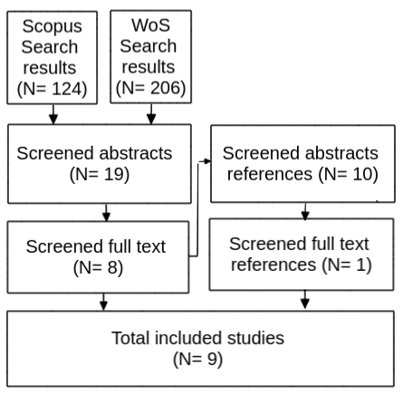

**Abstract**

<Background>Evidence shows that darkness discourages people from cycling.
This is mostly due to a higher perceived danger of cyclists at night from motorised traffic and personal security.
This disproportionately affect women, the elderly, and disadvantaged groups.
<Aim>This paper provides a review on the scientific literature that intersects between cycling and road lighting to better understand the relationship between both terms.
<Method>We used a hybrid systematic and snowballing method.
TBC studies on several disciplines such as engineering and technology, transportation, road safety, and public health were reviewed.
<Results>The literature suggests that...
Gaps in the literature are...
<Conclusion>

**Keywords** 

Cycling; road lighting; road safety; personal security; inequalities

# Introduction

Benefits of cycling are well established in the literature.
Cycling improves physical, mental, and social health; reduces pollution, carbon emissions, and congestion; and it is more inclusive than private motorised modes, reducing inequalities. For this reason, cycling is being encouraged. Yet, most people keep choosing to drive to cycle.

One of the main determinants of cycling is fear of motorised vehicles<reference needed>. Many studies have explored to what extent safe cycling infrastructure affects cycling.<add brief conclusions here>
However, less investigated have been other micro-built environmental factors such as road lighting, which may have a strong influence on people's fear when cycling.

<!-- Linear cycling infrastructure at ground level, such as cycle lanes, have received the bulk of research and policy attention in relation to investment in walking and cycling. However, localised treatments such as appropriate lighting and cycle parking can have a major impact on cyclability. There is much evidence suggesting darkness puts people off from cycling, and increases the risk of being involved in a collision whilst cycling. Appropriate road or path lighting can increase feelings of reassurance, make hazards more visible, and make the cyclist more visible to other road users. However, there is to date little evidence on the lighting interventions that work best, in combination with other measures. Lighting after dark has costs, both in terms of energy use and harmful ecological effects due to excess light pollution, raising the question: what is the optimal use of lighting to enable safe cycling uptake, at all times and in all seasons? -->


Previous academic literature reviews have touched on elements of the relationship between cycling and lighting.
@fotios_lighting_2017 reviewed suggested interventions to enable cycling lighting to contribute to the safety of cyclists in the UK. 
However, to the best of our knowledge, no academic paper has reviewed the international literature available on the intersection between both terms, cycling and road lighting. 

This paper aims to fill this gap in the literature, reviewing published research specifically focussed at the intersection between cycling and road lighting.

The review is guided by the following questions:

<!-- replace darkness with road lighting? -->

1.  To what extent does darkness influence cycling behaviour?

2.  To what extent does darkness increase the risk of road collision among cyclists?

3.  To what extent does darkness increase the risk of being a victim of crime among cyclists?

4.  Is the association between cycling and darkness the same between different groups?

5.  What type of road lighting is the most suitable for cycling to increase and be safer?

We focus on road and/or ambient lighting, excluding studies on lighting equipment for cyclists, such as reflective clothing or bicycle-mounted lights.

The review is organized as follows.
Section 2 describes the method.
Section 3 presents the findings of the papers reviewed.
Section 4 critically analyses the findings and identifies gaps in the literature.
Section 5 closes the work with the conclusions.

# Method

<!-- ## Search strategy -->
<!-- Two methods were used to conduct the literature review: (a) a systematic search, and (b) additional smaller searches and snowballing.  -->
<!-- For completeness, separate smaller searches and snowballing were applied for the theoretical review as well as when the researchers were aware that a body of literature existed, but our systematic search had not picked up on it.  -->

We used a hybrid systematic and snowballing method.
First, we searched in the SCOPUS electronic databased (on 15 November 2022) for studies investigating the relationship between cycling and road lighting.
The query string used for the search was as follows:

*(bicycl\* OR bik\* OR cycling OR cyclist\* OR "cycle hire") AND ("city light\*" OR "public light\*" OR "road light\*" OR "street light\*" or "city illumination" OR "public illumination" OR "road illumination" OR "street illumination" OR "city lamp\*" OR "public lamp\*" OR "road lamp\*" OR "street lamp\*" OR "lamp post\*" OR "light post\*" OR "light pole\*")* 

This search, based on the content of the title, abstract, and keywords, resulted in 262 records. 
After screening abstracts and full text, TBC studies were selected.
We excluded papers that did not focus on cycling and road lighting (many studies mentioned cycling and lighting in passing but not as the topic of the paper).

<!-- We excluded the following papers that could not be accessed: 

- Automated intelligent public lighting system

- Using of green energy from sustainable pavement plates for lighting bikeways

- Changing the DNA of city streets: NACTO's urban street design guide and the new city street design paradigm
-->

In the second stage, we checked the references from the studies selected (i.e. snowball technique), and after screening abstracts and full texts, TBC additional papers were selected.
In total, TBC were reviewed.
A flow chart of included studies is shown in Figure 1.

```{r fig1, echo=FALSE, fig.align="center", fig.cap="Review flow chart", out.width = '50%'}

```

<!-- ## Data extraction -->

<!-- From the included studies, we extracted information regarding: location of study, methodology, cycling uptake and lighting measurements, mode, sign of association, and authors and year. -->


# Results

<Subject area>The scientific literature was found to be broadly spread across several disciplines, including engineering and technology, transportation, road safety, and public health.

<Themes>Five main themes emerged:
1.  Cycling behaviour and lighting
2.  Cycling collisions and lighting
3.  Cycling, crime and lighting
4.  Cycling inequalities in lighting
5.  Proper lighting for cyclists 

<!-- (i.e. optimal use of lighting to enhance cyclists reassurance while respecting the environment) -->

<Study type>Most of the studies were written in the last decade, 53 were empirical and 9 were reviews (Figure 1).

```{r fig2, echo=FALSE, message=FALSE, warning=FALSE}
library(kableExtra)
library(tidyverse)

papers <- read.csv("lrp-papers-summary-syst.csv")

df = papers %>% replace(is.na(.), 0) %>%
  group_by(year, type) %>% 
  summarise(number = n())

ggplot(df, aes(x = year, y = number, fill = type)) +
  geom_bar(stat="identity") +
  labs(x ="", y="number of papers") +
  theme_minimal()
```


<!-- <type of empirical papers> Most of the empirical studies were quantitative (), five of them qualitative, and one of them mixed methods. -->

## Cycling behaviour and lighting

<!-- I could also divide the section on quantitative studies and objective and subjective. -->

Previous research has found a clear association between active travel or physical activity levels and road lighting.
For example, using odd ratios to compare traffic flows in case and control hours, @fotios_effect_2022 found that darkness had a significant negative effect on the number of pedestrians and cyclists, but not on the number of motorized vehicles.

[@castillo-paredes_perceived_2022]

Using Strava Heatmap data and spatial regression models, @yang_crowdsourced_2022 found street lighting positively associated with running, but not with cycling. 

Using satellite and street view imagery and linear regressions, @zacharias_environmental_2021 found street lighting highly significantly associated with higher uptake and deposit of dock-less shared bicycle trips.

Using odd ratios, @uttley_road_2020 found that the drop in cycling levels after dark was substantially greater in unlit locations, compared with lit locations. @uttley_road_2020 also found a non-linear relationship between relative brightness and the reduction in cyclists after-dark, suggesting that a minimal amount of lighting could be enough to promote cycling after dark.

@fotios_whole-year_2019 found that "ambient light has a significant impact: For a given time of day, more people walk or cycle when it is daylight than after dark and more people cycle on cycle trails and walk on foot paths after dark when they are lit than when they are unlit".

This supported previous work which "indicated the numbers of pedestrians and cyclists during the case period were significantly higher during daylight conditions than after-dark, resulting in a 62% increase in pedestrians and a 38% increase in cyclists" [@uttley_using_2017].

In a review of forty two quantitative studies that estimated association between neighbourhood build environment and active travel in older adults, @cerin_neighbourhood_2017 observed positive associations with availability of street lights.

Using self-reported commuting data, @yang_longitudinal_2017 found that individuals living in neighbourhoods with higher density of street light were more likely to active commuting.

```{r tab4, echo=FALSE, message=FALSE, warning=FALSE}
library(kableExtra)
library(tidyverse)

papers <- read.csv("lrp-papers-summary-syst.csv")

df = papers %>%
  filter(behaviour == 1) %>% 
  select(authors, year, title, type)

kbl(df,
    caption = "Table 1: Overview of papers on cycling and lighting") %>%
    kable_styling()
```

## Cycling collisions and lighting

One of the main reasons that cycling decreases in the dark is because cyclists need to see obstacles on the road and be seen by other road users.

The probability of suffering a traffic collision in the dark among pedestrians and cyclists is much greater than among other road users.

Not only the frequency but also the severity of injury is higher at night-time.

Most of the research on lighting and road safety is based on the US.

In the US the number of pedestrians fatally injured has increased considerably in the last years, and this increase has been happened particularly during the night [@ferenchak_shedding_2022 and others].
Compare with UK data.

"A pedestrian injured in the dark was found to be 5.0 times more likely to be killed than a pedestrian injured during the day. While a lack of street lighting does not seem to be the cause of the disproportionate increase in pedestrian injuries at night, pedestrians struck without a street light were 2.4 times more likely to be killed than those struck in the presence of a street light" [@ferenchak_shedding_2022].

A study on bicycle-motor vehicle crashes found that "crashes in low light conditions and during early morning hours are more likely to result in higher injury severity" [@asgarzadeh_impact_2018].

Papers on crashes during darkness in intersections.

Intersections: an study showed that "an increase in intersection illuminance from low (\<0.2 fc) to medium (≥ 0.2 fc and \<1.1 fc) could reduce nighttime crash frequency and night-to-day crash ratios by approximately 50%. When illuminance was kept at 0.9 fc or higher, the risk of fatality and severe injury decreased significantly, especially in crashes that involved pedestrians and bicycles, head-on crashes, and angle crashes" [@wei_safety_2016].

@nabavi_niaki_road_2016 found that "an increase in road lighting was associated with more bicycle and pedestrian accidents, which might have been explained by the decision to add or increase the amount of lighting at locations in which accidents occurred".

Alcohol consumption.
"The proportion of seriously injured cyclists who have been drinking is highest in early morning darkness and has strongly increased over the last decades" [@twisk_epidemiological_2013].

"Injury accidents in on lit roads are reduced by 50%. The effect on fatal accidents is slightly larger. The effect during twilight is about 2/3 of the effect in darkness. The effects on pedestrian, bicycle and moped accidents are significantly larger than the effects on automobile and motorcycle accidents. The risk of injury accidents was found to increase in darkness. The average increase in risk was estimated to 17% on lit rural roads and 145% on unlit rural roads. The average increase in risk with respect to pedestrian accidents is about 140% on lit rural roads and about 360% on unlit rural roads" [@wanvik_effects_2009].

```{r tab5, echo=FALSE, message=FALSE, warning=FALSE}
df = papers %>%
  filter(road_safety == 1) %>% 
  select(authors, year, title, type)

kbl(df,
    caption = "Table 2: Overview of papers on cycling collisions and lighting") %>%
    kable_styling()
```

## Cycling, crime, and lighting

Another fundamental factor that explains less cycling during night-time is fear of crime.

There is evidence that street lighting decreases crime and enhances reassurance and confidence of pedestrians and cyclists after dark (e.g. @loukaitou-sideris_is_2006).

People's perceived nighttime safety (qualitative research):

"Danger was predicted by the pleasantness of the lighting, gender, brightness and environmental trust" [@johansson_individual_2011].

```{r tab6, echo=FALSE, message=FALSE, warning=FALSE}
df = papers %>%
  filter(crime == 1) %>% 
  select(authors, year, title, type)

kbl(df,
    caption = "Table 3: Overview of papers on cycling, crime, and lighting") %>%
    kable_styling()
```

## Cycling inequalities in lighting

Fear of danger of injury from traffic, falls, or violence seems to affect groups differently.

"Studies that focused on women, children, and the elderly have been able to identify a stronger link between feelings of risk and fear at the neighborhood and high levels of inactivity" [@loukaitou-sideris_is_2006].

<Gender>

"for pedestrians, the deterrence of darkness was similar for males and females" [@fotios_extending_2022].

"Women are more sensitive to dark spaces when walking and cycling than men" [@xie_i\_2018].

"Women have a higher perceived risk of being assaulted/robbed/harassed compared with men. At night, pedestrians perceived suburban environments as insecure, and the change in the level of security was higher for women than men. Also, night time security varied over different land-use types between men and women" [@basu_unequal_2021].

"the participating women in general, assessed the path as more dangerous than did the men" [@johansson_individual_2011].

<Age>

Younger people can see better than older.
A review on environments and physical activity among children and youth found not a very consistent positive associations between street lighting and physical activity [@prince_examining_2022].

Older people may detect object differently than younger people.

<Disadvantaged groups>

Qualitative research on perceptions of fear to crime and rashes of cyclists from most deprived neighbourhoods [@lusk_bicycle_2019].

```{r tab7, echo=FALSE, message=FALSE, warning=FALSE}
df = papers %>%
  filter(inequalities == 1) %>% 
  select(authors, year, title, type)

kbl(df,
    caption = "Table 4: Overview of papers on inequalities and lighting") %>%
    kable_styling()
```

## Proper lighting for cyclists

A large number of papers found in our search focused on investigating which type of road lighting is most appropriate to improve cyclists reassurances.
I.e. How lighting attributes such as illuminance, light temperature, uniformity and glare, affect cycling.

Smart Street Lighting (that adapts to movement by pedestrians, cyclists, and cars) papers.

"minimum illuminance is a better predictor of reassurance than is mean illuminance. For a day--dark difference of 0.5 units on a 6-point response scale, the results suggest a minimum horizontal illuminance of approximately 2.0 lux" [@fotios_evaluation_2019].

"Review of the characteristics of lighting suggests an optimum illuminance of 10 lux, of high S/P ratio, and aimed toward the pedestrian and natural elements of the environment, will enhance reassurance" [@fotios_road_2015].

```{r tab8, echo=FALSE, message=FALSE, warning=FALSE}
df = papers %>%
  filter(proper_light == 1) %>% 
  select(authors, year, title, type)

kbl(df,
    caption = "Table 5: Overview of papers on proper lighting") %>%
    kable_styling()
```

# Discussion

The scientific literature on the intersections of cycling and lighting is spread across several disciplines such as transportation, public health, road safety, criminology, studies of social inequalities, and engineering and technology.

**To what extent does darkness influence cycling behaviour?**

The positive results obtained in studies looking at the association between cycling uptake and street lighting show the importance of light conditions as a policy measure to encourage cycling in the dark. Lighting conditions improvements not only may increase cycling trips in general, but also the inclusivity of cycling, since, as has been demonstrated, street lighting will benefit more certain sectors of society such as women, children, the elderly, and certain disadvantaged groups.

**To what degree does darkness increase the risk of road collision among cyclists?**

**To what extent does darkness increase the risk of being a victim of crime among cyclists?**

**Is the association between cycling and darkness the same between different groups?**

**What type of road lighting is the most suitable for cycling to increase and be safer?**

Other interesting questions to respond:

- What happens to people who do not cycle when it is dark? Do they change their routes? Do they change their mode of transport?

- Is traffic stress or darkness a bigger barrier to cycling (and impact of lighting)?

## Research gaps

-   Lack of research in developing countries

-   Methodological inconsistencies (see @loukaitou-sideris_is_2006)

## Strenghts and limitations

# Conclusions

This paper reviewed published research at the intersection between cycling and road lighting.

<gaps>Although there has been a recent growth of papers on this topic the is still highly under-researched. More empirical work in the area of cycling and road lighting is needed.

<!-- We plan to undertake some of this work over the coming months in the SATURN (Supporting Active Travel Using Road lighting at Night) project, which has been funded by the UK Research and Innovation body. -->

<!-- During the project we plan to measure change in cycling levels, primarily through cyclists counts, and cycling safety due to darkness as inferred from models of cycling levels and high resolution casualty over multi year timescales and in a number of different locations. -->

<!-- Comparing resulting estimates of change in cycling and safety levels will help assess the impact of lighting in those locations, but there is much else to do in this field beyond what is possible in a 24 month research project. -->

<!-- Further work is needed to better understand how lighting characteristics such as illuminance and the spatial distribution of lighting influence cycling rates and cyclist safety. -->

<!-- To ensure the policy relevance of future work into road lighting and cycling, it is important that the findings feed into larger models of cycling uptake to support cost effective investment in road and path lighting [@fotios_pilot_2017], as part of balanced packages of interventions, for the benefit of people who stand to benefit from better walking, cycling and wheeling provision worldwide. -->

# Declaration of interest statement

# References