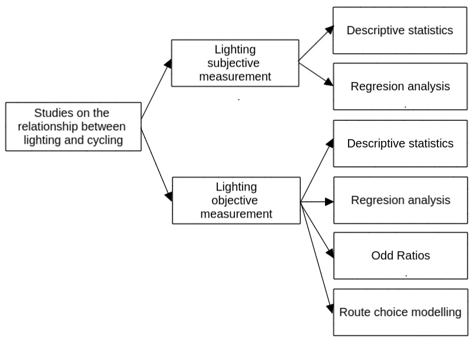

<!-- Alternative title:
- Road lighting and cycling uptake
- Ambient light, lighting, and cycling rates -->

**Abstract**

<Background>Many studies have explored the extent to which macro-built environmental attributes (e.g. population density, land use mix, proximity, spatial connectivity), and especially bicycle paths and lanes, affect cycling uptake.
Less attention has been paid to the impact that micro-built environmental factors such as road lighting may have on people's choice to cycle.
This paper provides a review of the scientific literature on the relationship between road lighting and cycling uptake and identifies existing gaps in research and knowledge.
<Method>We used a hybrid systematic and snowballing method.
Nine empirical scientific studies were reviewed. 
These studies can be divided into those that use a subjective measurement of road lighting and those that use an objective measurement.
<Results>Most of the studies analysed indicate that road lighting has a strong positive effect on cycling levels during the night. 
The impact is higher among women. 
This suggests that road lighting may be a key measure to increase cycling and make it safer and more equitable.
More research is needed, including on the reasons road lighting is relevant to cyclists, the different impacts that road lighting may have on cyclist groups, the appropriate road lighting for cyclists, and in developing countries and countries with extreme latitudes. 
<Conclusion>

<!-- To what extent darkness or lack of road lighting deter people from cycling? -->

<!-- Linear cycling infrastructure at ground level, such as cycle lanes, have received the bulk of research and policy attention in relation to investment in cycling.  -->
<!-- However, localised treatments such as appropriate lighting and cycle parking can have a major impact on cyclability.  -->
<!-- There is evidence suggesting darkness discourages people from cycling, and increases the risk of being involved in a collision whilst cycling.  -->
<!-- Appropriate road or path lighting can increase feelings of reassurance, make hazards more visible, and make the cyclist more visible to other road users.  -->
<!-- However, there is to date little evidence on the lighting interventions that work best, in combination with other measures.  -->
<!-- Lighting after dark has costs, both in terms of energy use and harmful ecological effects due to excess light pollution, raising the question: what is the optimal use of lighting to enable safe cycling uptake, at all times and in all seasons? -->

**Keywords** 

Cycling; road lighting; road safety; personal security; inequalities

# Introduction

Benefits of cycling are well established in the literature.
Cycling improves physical, mental, and social health; reduces pollution, carbon emissions, and congestion; and it is more inclusive than private motorised modes, reducing inequalities [@oja_health_2011]. 
For this reason, cycling is generally encouraged. Yet, cycling levels are low in most cities around the world.

Many studies have explored the extent to which macro-built environmental attributes such as population density, land use mix, proximity, spatial connectivity and especially safe cycling infrastructure affects cycling uptake (e.g. [@buehler_cycling_2012; @fraser_cycling_2011; @winters_bike_2016].
However, less investigated have been micro-built environmental factors such as road lighting, which may have a strong influence on people choice to cycle. 

There is evidence suggesting that darkness discourages people from cycling [@fotios_effect_2022; @fotios_whole-year_2019; @uttley_using_2017]. 
This is due to a higher perceived danger of cyclists at night from motorised traffic and crime and personal security, which disproportionately affect women, the elderly, and disadvantaged groups [ @fotios_extending_2022, @schneider_perceived_2022].
Road lighting can provide reassurance to cyclists to overcome this barrier, increasing cycling levels, and making cycling safer and more equitable.
<!-- Any other relevant literature review fond in the search? -->
<!-- Previous research has found a positive association between street lighting and physical activity (PA) and active travel (AT) [@prince_examining_2022; @bonaccorsi_impact_2020]. -->

Previous academic literature reviews have touched on elements of the relationship between cycling and lighting.
For example, @fotios_lighting_2017 reviewed suggested interventions to enable cycling lighting to contribute to the safety of cyclists in the UK. 
@reynolds_impact_2009 reviewed the impact of transport infrastructure, including street lighting, on cycling collisions.
Other reviews have looked at the associations between active travel or physical and environmental factors, including street lighting (e.g. @cerin_neighbourhood_2017; @prince_examining_2022). 
However, to the best of our knowledge, no academic paper has reviewed the international literature available on the relationship between road lighting and specifically cycling uptake.
This paper aims to fill this gap in the literature.

The review is guided by the following questions: 

1.  To what extent does road lighting influence cycling uptake?

2.  What are the possible causes of this positive association?

3.  Is the association the same between different groups?

4.  What type of road lighting is the most suitable for cyclists?

The review is organized as follows.
Section 2 describes the method.
Section 3 presents the findings of the papers reviewed.
Section 4 critically analyses the findings, responding the review 
questions, and identifies gaps in the literature.
Section 5 closes the work with the conclusions.

# Method

## Search strategy

We used a hybrid systematic and snowballing method. 
First, we searched in Elsevierś Scopus and Web of Science (WoS) (on 11 January 2023) for empirical studies investigating the relationship between cycling and road lighting. 
All searches were based on the content of the title, abstract, and keywords, and the query string used for the search was as follows:

<!-- the two the main sources for citation data, Elsevierś Scopus and Web of Science (WoS) (on 6 January 2023) [@mongeon_journal_2016] -->

*("city light\*" OR "public light\*" OR "road light\*" OR "street light\*" or "city illumination" OR "public illumination" OR "road illumination" OR "street illumination" OR "city lamp\*" OR "public lamp\*" OR "road lamp\*" OR "street lamp\*" OR "lamp post\*" OR "light post\*" OR "light pole\*") AND (bicycl\* OR bik\* OR cycling OR cyclist\* OR "cycle hire")*  

The search resulted in 124 records in Scopus and 206 in WoS. 
Only studies that strictly focused on the relationship between road lighting and cycling uptake were selected. 
We excluded, therefore, studies that examined the relationship between road lighting and cycling safety safety, studies that analysed the association between ambient lighting or darkness and cycling uptake, and studies on lighting equipment for cyclists, such as reflective clothing or bicycle-mounted lights.
After combining the search results, excluding duplicates, and examining abstracts and full texts for this content, 8 studies were selected.

Second, to make sure we didn't miss any important studies, we checked the references from the studies selected (i.e. snowball technique), and after screening abstracts and full texts of these references, 1 additional paper was selected.
In total, 9 studies were reviewed.
A flow chart of the search strategy is shown in Figure 1.

```{r fig1, echo=FALSE, fig.align="center", fig.cap="Figure 1: flow chart", out.width = '40%'}
knitr::include_graphics("flow-chart.png")
```

<!-- Paper we did not have access: -->

<!-- - S. Chandra, R. Radhakrishnan, Street visibility-dependent path finding for pedestrians and bicyclists in urban areas, Transportation Research Board 94th Annual Meeting, Transportation Research Board, Washington DC, United States, 2015. 

- REFERENCE: Categorizing bicycling environments using GPS-based public bicycle speed data
-->

## Data extraction

The following information was extracted from each study: author(s) and year, location of study, measurements for cycling and lighting, type of measurements, method or analytical tool, and results (Table 1). 
<!-- For analytical reasons, the type of measurements were classified into subjective and objective, depending on whether the associations were perceived (subjective) or objectively measured (objective). -->

# Results

## Trends and types of research

The scientific literature on the relationship between road lighting and cycling uptake was found to be broadly spread across several disciplines, including engineering, public health, urban design/planning, and transport planning.

Research on the relationship between road lighting and cycling uptake seems very recent. All the studies found were written in the last fifteen years. Most of the studies were from North America (5), 2 from South America, 1 from the United Kingdom, and 1 from China. 

For the purposes of this analysis, the studies can be divided into those that examine the relationships between road lighting and cycling uptake using descriptive analysis and inferential analysis. 
Another useful categorization of studies is based on the type of road lighting measurement, which can be subjective or objective.

```{r fig2, eval=FALSE, fig.align="center", fig.cap="Figure 2: Trends and types of studies reviewed", message=FALSE, warning=FALSE, include=FALSE, out.width='75%'}
library(kableExtra)
library(tidyverse)

papers <- read.csv("lrp-papers-summary.csv")

df = papers %>% replace(is.na(.), 0) %>%
  filter(full_text == 1) %>% 
  group_by(year, measurement_types) %>% 
  summarise(number = n())

x_axis_labels <- min(df[,"year"]):max(df[,"year"])

ggplot(df, aes(x = year, y = number, fill = measurement_types)) +
  geom_bar(stat="identity") +
  labs(x ="", y="Number of studies reviewed") +
  scale_y_continuous(breaks= c(0, 2, 4, 6, 8, 10)) +
  scale_x_continuous(labels = x_axis_labels, breaks = x_axis_labels) +
  scale_fill_discrete(name = "Study type") +
  theme_minimal() +
  theme(axis.text.x = element_text(angle = 90, vjust = 0.5, hjust=1)) 
```

<!-- Correlational research studies and Descriptive research studies. -->

<!-- "Subjective measures of reassurance are prone to stimulus range bias and socially desirable responding, and, as stated preferences, it is unknown whether they are reflected in behaviour (revealed preference). -->
<!-- A more direct approach to investigating whether road lighting influence cycling is to count the number of people using these transport modes in different light conditions. If darkness reduces reassurance, then there will be fewer pedestrians and cyclists. This has been investigated, and confirmed, in studies taking advantage of variation in daylight, either the seasonal variation or the sudden transition imposed by biannual daylight saving clock changes" [@fotios_extending_2022]. Objective measures of behaviour provide stronger evidence. -->

<!-- Range bias in evaluations of perceived safety [@fotios_specifying_2016]. -->

<!-- "The daylight savings method of analysis better isolates changes in weather from the effects of ambient light on travel choice than does the whole-year method" [@fotios_whole-year_2019]. -->

```{r fig3, eval=FALSE, fig.align="center", fig.cap="Figure 2: Study types", include=FALSE}

```

## Empirical findings

<!-- Divide perhaps between objective and subjective studies -->
An study that examined the association between perceived neighborhood safety indicators and domain-specific active transportation in Latin America found that "the odds of cycling participation and duration is not higher in participants who agreed that streets were well lit" [@castillo-paredes_perceived_2022].

Using satellite and street view imagery and linear regressions, @zacharias_environmental_2021 found that "street lighting is positively associated with dock-less shared bicycle uptake and deposit".

Using odd ratios, @uttley_road_2020 found that the drop in cycling levels after dark was substantially greater in unlit locations, compared with lit locations. @uttley_road_2020 also found "a non-linear relationship between relative brightness and the reduction in cyclists after-dark, suggesting that a minimal amount of lighting could be enough to promote cycling after dark".

@fotios_whole-year_2019 found that "more people cycle on cycle trails and walk on foot paths after dark when they are lit than when they are unlit".

"Some bicyclists favor routes which are planted with street trees or installed with street lights" [@chen_gps_2018].

In a paper that estimated welfare change associated with improvements in urban bicycling facilities, @poorfakhraei_estimating_2015 found that "cycle tracks were valued the most, followed by street lighting, and bicycle lanes".

"Street lighting and security are two of the main factors (5 and 6 out of 18) for cycle commuting routes after 1) number of trucks 2) buses and 3) traffic volume and 4) speed" [@segadilha_identification_2014].

"Increasing street lighting is the second top suggestions for cyclists to improve safety" [@sanders_all_2013].

Respondents in a study that examined if neighbourhood environments were associated with walking and cycling, reported that good lighting at night is an important facilitator of cycling [@lee_neighbourhood_2008].

```{r tab4, echo=FALSE, message=FALSE, warning=FALSE}
library(kableExtra)
library(tidyverse)

papers <- read.csv("lrp-papers-summary.csv")

df = papers %>%
  filter(full_text == 1) %>% 
  
  select(authors, location, cycling, lighting, measurement_types, analytical_tool, result)

kbl(df,
    caption = "Table 1: Overview of studies on the association between road lighting and cycling uptake") %>%
    kable_styling()
```

# Discussion

This paper reviewed the scientific literature on the relationship between road lighting and cycling uptake.

<!-- Use papers on ambient lighting and darkness to guess responses the current studies do not answer. -->

#### To what extent does road lighting influence cycling uptake?

The positive results obtained in studies looking at the association between cycling uptake and street lighting show the importance of light conditions as a policy measure to encourage cycling in the dark. 
Lighting conditions improvements not only may increase cycling trips in general, but also the inclusivity of cycling, since, as has been demonstrated, street lighting will benefit more certain groups such as women.

#### What are the possible causes of this positive association?

Road lighting help cyclists at night to visualize their route in the dark (allowing obstacles and trip hazards to be seen and avoided). 
It makes cyclists feel more visible and less at risk of being hit by motorised traffic during their journeys at night. 
Also, it provides them with a greater sense of security against possible threats in the dark.

Another factor that explains why there is less cycling at night is the fear of crime. 
This is much less investigated than the relationship between lighting and cycling collisions.
There is evidence that street lighting decreases crime and enhances reassurance and confidence of pedestrians and cyclists after dark [e.g. @castillo-paredes_perceived_2022].

<!-- "Variables related to crime and lighting of public spaces were associated with active travel in countries in Latin America" [@castillo-paredes_perceived_2022]. -->

<!-- "Violent crimes appear to significantly deter people from choosing to walk or bicycle, potentially exposing themselves to threats of personal injury" [@appleyard_influence_2017]. -->

<!-- "High-crime neighborhoods tend to discourage residents from walking or riding a bicycle" [@ferrell_influences_2012]. -->

<!-- @cervero_travel_1997 "suggested that the presence of road lighting and the distance between lamps were significant aspects of neighbourhood design that contributed to encouraging non-automobile travel". -->

#### Is the association the same between different groups?

<!-- Fear of danger of injury from traffic, falls, or violence seems to affect groups differently. -->
@fotios_extending_2022 found that the deterrent of darkness for cycling was greater for females than for males. 
@heinen_day_2011 found that women are less likely to cycle to work in the dark.

<!-- "Recent research [@sustrans_bikelife_2018] found that only 23% of women felt safe cycling during hours of darkness, compared with 36% of men, which suggests that Lighting may also contribute to addressing the current gender imbalance in cycling by encouraging more women to cycle after-dark" [@uttley_road_2020]. -->

<!-- "Women are more sensitive to dark spaces when walking and cycling than men" [@xie_i_2018]. -->

<!-- "The dominant deterrents to bicycle commuting are unpleasant weather and inadequate daylight" [@stinson_frequency_2004] -->

####  What type of road lighting is the most suitable for cyclists?

Studies used different measurements for road lighting, without specifying the type or levels of lighting.
Find out the most suitable, environmentally friendly and "green" solution to fulfill the cyclists road lighting requirements. 

@uttley_road_2020 found "a non-linear relationship between relative brightness and the reduction in cyclists after-dark, suggesting that a minimal amount of lighting could be enough to promote cycling after dark".

[@fotios_lighting_2017]

## Research gaps

Based on these findings, we highlight the following research needs:

- More focus on the effect of road lighting specifically on cycling. 
Many studies look at road lighting and physical activity and active travel, failing to separate walking and cycling. 
The characteristics of environments encouraging walking may be different from those supporting cycling. 

- More research on the reasons why road lighting is important for cyclists. Which of the possible reasons has more weight? Because it helps them to visualize their route in the dark? 
To make them feel more visible and less at risk of being hit? 
Or to make them feel safer from being a victim of crime? 
Answers to these questions may help to adopt different policies to reduce the impact of darkness on cycling levels.

- Deeper understanding on how road lighting affects different cyclist groups (frequent cyclists, occasional cyclists, or potential cyclists). 
Also gender-age groups are under-research. Do young female perceive cycling in the dark more dangerous than other women-age groups due to the risk of sexual assault?

- Further research is needed on the specific type of road lighting appropriate for cyclists. 

- More research in developing countries. 
"Lack of street lighting can contribute to poor visibility, perception and fear of crime thus decreasing bicycle use. This is particularly relevant in  Sub-Saharan Africa due to the generalized lack of security and safety" [@mendiate_cycling_2022]. Poor infrastructure. Low road lighting density.

- More research in extreme latitude locations, which have longer durations of darkness during parts of the year.

- Who is most affected by the need for road lighting when cycling? Frequent cyclists, occasional cyclists, or potential cyclists?

<!-- -   Lack of research in developing countries -->

## Strenghts and limitations

<Strength>This paper provides a review of the scientific literature on the relationship between road lighting and cycling uptake and identifies existing gaps in research and knowledge. 
To the best of our knowledge, no papers had looked at this association and gaps in the literature before.
<Limitations>Nevertheless, the paper has several limitations: 

- The method used for this review (using two search databases and the snowball technique) tries to guarantee a wide coverage. However, we are aware that some studies not included in the selected search databased, nor in the references of the papers found, or included in the search databased but not found when filtering by title, abstract, and keywords have not been reviewed.

- We do not include and analyse the controls used in each of the studies.

# Conclusions

This paper reviewed academic research on the association between road lighting and cycling uptake.

<gaps>Despite the recent growth of articles on this topic, it is still under-researched. More empirical work in the area of cycling and road lighting is needed.

<!-- The review presented above highlights the need for more empirical work in the area of cycling uptake (which means tackling the barriers to cycling including road safety and perceived personal safety) and lighting.  -->

<!-- We plan to undertake some of this work over the coming months in the SATURN (Supporting Active Travel Using Road lighting at Night) project, which has been funded by the UK Research and Innovation body.  -->

<!-- During the project we plan to  measure change in cycling levels, primarily through cyclists counts, and cycling safety due to darkness as inferred from models of cycling levels and high resolution casualty over multi year timescales and in a number of different locations.  -->

<!-- Comparing resulting estimates of change in cycling and safety levels will help assess the impact of lighting in those locations, but there is much else to do in this field beyond what is possible in a 24 month research project.  -->

<!-- Further work is needed to better understand how lighting characteristics such as illuminance and the spatial distribution of lighting influence cycling rates and cyclist safety.  -->

<!-- To ensure the policy relevance of future work into road lighting and cycling, it is important that the findings feed into larger models of cycling uptake to support cost effective investment in road and path lighting (Fotios et al., 2017), as part of balanced packages of interventions, for the benefit of people who stand to benefit from better walking, cycling and wheeling provision worldwide. -->

# Disclosure statement

No potential conflict of interest was reported by the author(s).

# References