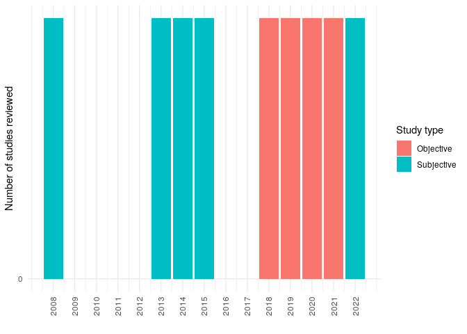

Cycling and Road Lighting: A Review
================

# Abstract

Background: Evidence shows that darkness discourages people from
cycling. This is mostly due to a higher perceived danger of cyclists at
night from motorised traffic and personal security. This may
disproportionately affect women, children, the elderly, and
disadvantaged groups.

Aim: This paper provides a review on the scientific literature that
intersects between cycling and road lighting to better understand the
relationship between both terms.

Method: We used a hybrid systematic and snowballing method. TBC studies
on several disciplines such as transportation, public health, road
safety, criminology, social inequalities, and engineering and technology
were reviewed.

Results: The literature suggests that… Gaps in the literature are…

Conclusion:

# Introduction

Benefits of cycling are well established in the literature. Cycling
improves physical, mental, and social health; reduces pollution, carbon
emissions, and congestion; and it is more inclusive than private
motorised modes, reducing inequalities.

Many variables (individual, social, and environmental) can affect an
individual’s decision to cycle.

Darkness is one of the environmental factors that most affect cycling.
Previous academic literature reviews have touched on elements of the
relationship between cycling and lighting.

S. Fotios and Castleton (2017) reviewed suggested interventions to
enable cycling lighting to contribute to the safety of cyclists in the
UK. However, to the best of our knowledge, no academic paper has
reviewed the international literature available on the intersection
between both terms, cycling and road lighting.

This paper aims to fill this gap in the literature, reviewing published
research specifically focussed at the intersection between cycling and
road lighting.

The review is guided by the following questions:

1.  To what extent does darkness influence cycling behaviour?

2.  To what extent does darkness increase the risk of road collision
    among cyclists?

3.  To what extent does darkness increase the risk of being a victim of
    crime among cyclists?

4.  Is the association between cycling and darkness the same between
    different groups?

5.  What type of road lighting is the most suitable for cycling to
    increase and be safer?

We focus on road and/or ambient lighting, excluding studies on lighting
equipment for cyclists, such as reflective clothing or bicycle-mounted
lights.

The review is organized as follows. Section 2 describes the method.
Section 3 presents the findings of the papers reviewed. Section 4
critically analyses the findings and identifies gaps in the literature.
Section 5 closes the work with the conclusions.

# Method

<!-- ## Search strategy -->
<!-- Two methods were used to conduct the literature review: (a) a systematic search, and (b) additional smaller searches and snowballing.  -->
<!-- For completeness, separate smaller searches and snowballing were applied for the theoretical review as well as when the researchers were aware that a body of literature existed, but our systematic search had not picked up on it.  -->

We used a hybrid systematic and snowballing method. First, we searched
in the SCOPUS electronic databased (on 15 November 2022) for studies
investigating the relationship between cycling and road lighting. The
query string used for the search was as follows:

*(bicycl\* OR bik\* OR cycling OR cyclist\* OR “cycle hire”) AND (“city
light\*” OR “public light\*” OR “road light\*” OR “street light\*” or
“city illumination” OR “public illumination” OR “road illumination” OR
“street illumination” OR “city lamp\*” OR “public lamp\*” OR “road
lamp\*” OR “street lamp\*” OR “lamp post\*” OR “light post\*” OR “light
pole\*)”*

This search, based on the content of the title, abstract, and keywords,
resulted in 262 records. After screening abstracts and full text, TBC
studies were selected. We excluded papers that did not focus on cycling
and road lighting (many studies mentioned cycling and lighting in
passing but not as the topic of the paper).
<!-- We excluded six papers that could not be accessed. -->

In the second stage, we checked the references from the studies selected
(i.e. snowball technique), and after screening abstracts and full texts,
TBC additional papers were selected. In total, TBC were reviewed. A flow
chart of included studies is shown in Figure 1.

<!-- We need to define scope of the review - we are looking at papers that: Investigate the effects of light and lighting in some way, including road lighting or ambient light, but excluding other types of lighting such as cycle-mounted lighting Relate to cycling rates or cycling propensity, i.e. not related to cyclist safety? -->
<!-- Other parameters for scope? -->
<!-- ## Data extraction -->
<!-- From the included studies, we extracted information regarding: location of study, methodology, cycling uptake and lighting measurements, mode, sign of association, and authors and year. -->

# Results

The scientific literature was found to be broadly spread across several
disciplines, including transportation, public health, road safety,
criminology, social inequalities, and engineering and technology. Five
main themes were identified:

1.  Cycling behaviour and lighting

2.  Cycling collisions and lighting

3.  Cycling, crime and lighting

4.  Cycling inequalities in lighting

5.  Proper lighting for cyclists (i.e. optimal use of lighting to
    enhance cyclists reassurance while respecting the environment)

Figure 1 shows the number of papers reviewed for each of the identified
themes (some of the papers deal with more than one).

<!-- -->

Three quarters of the studies were empirical studies and one quarter
were reviews. Most of the empirical studies were quantitative, five of
them qualitative, and one of them mixed methods.

## Cycling behaviour and lighting

<!-- I could also divide the section on quantitative studies and objective and subjective. -->

Previous research has found a clear association between active travel or
physical activity levels and road lighting. For example, using odd
ratios to compare traffic flows in case and control hours, Steve Fotios
and Robbins (2022) found that darkness had a significant negative effect
on the number of pedestrians and cyclists, but not on the number of
motorized vehicles.

Using Strava Heatmap data and spatial regression models, Linchuan Yang
et al. (2022) found street lighting positively associated with running,
but not with cycling.

Using satellite and street view imagery and linear regressions,
Zacharias and Meng (2021) found street lighting highly significantly
associated with higher uptake and deposit of dock-less shared bicycle
trips.

<!-- @rahm_evening_2021 found that "the quality of urban greenery and street lighting impacted people’s route choices after dark, and some participants felt compelled to make detours. Entrapment, partly due to unkempt greenery in combination with darkness, contributed to avoidance, whereas the presence of other people had the opposite effect".  -->

Using odd ratios, Uttley, Fotios, and Lovelace (2020) found that the
drop in cycling levels after dark was substantially greater in unlit
locations, compared with lit locations. Uttley, Fotios, and Lovelace
(2020) also found a non-linear relationship between relative brightness
and the reduction in cyclists after-dark, suggesting that a minimal
amount of lighting could be enough to promote cycling after dark.

S. Fotios, Uttley, and Fox (2019) found that “ambient light has a
significant impact: For a given time of day, more people walk or cycle
when it is daylight than after dark and more people cycle on cycle
trails and walk on foot paths after dark when they are lit than when
they are unlit”.

This supported previous work which “indicated the numbers of pedestrians
and cyclists during the case period were significantly higher during
daylight conditions than after-dark, resulting in a 62% increase in
pedestrians and a 38% increase in cyclists” (Uttley and Fotios 2017b).

<!-- In a review of forty two quantitative studies that estimated association between neighbourhood build environment and active travel in older adults, @cerin_neighbourhood_2017 observed positive associations with availability of street lights. -->

Using self-reported commuting data, Lin Yang et al. (2017) found that
individuals living in neighbourhoods with higher density of street light
were more likely to active commuting.

<!-- @pena-garcia_impact_2015 found that "well illuminated streets (that is, where lighting is uniform) with higher illuminance levels, tend to make people feel safer and better". -->
<table class="table" style="margin-left: auto; margin-right: auto;">
<caption>
Table 1: Overview of papers on cycling and lighting
</caption>
<thead>
<tr>
<th style="text-align:left;">
authors
</th>
<th style="text-align:right;">
year
</th>
<th style="text-align:left;">
title
</th>
<th style="text-align:left;">
type
</th>
</tr>
</thead>
<tbody>
<tr>
<td style="text-align:left;">
Linchuan Yang et al. (2022)
</td>
<td style="text-align:right;">
2022
</td>
<td style="text-align:left;">
Crowdsourced Data for Physical Activity-Built Environment Research:
Applying Strava Data in Chengdu, China
</td>
<td style="text-align:left;">
empirical
</td>
</tr>
<tr>
<td style="text-align:left;">
Steve Fotios and Robbins (2022)
</td>
<td style="text-align:right;">
2022
</td>
<td style="text-align:left;">
Effect of Ambient Light on the Number of Motorized Vehicles, Cyclists,
and Pedestrians
</td>
<td style="text-align:left;">
empirical
</td>
</tr>
<tr>
<td style="text-align:left;">
Zacharias and Meng (2021)
</td>
<td style="text-align:right;">
2021
</td>
<td style="text-align:left;">
Environmental correlates of dock-less shared bicycle trip origins and
destinations
</td>
<td style="text-align:left;">
empirical
</td>
</tr>
<tr>
<td style="text-align:left;">
Rahm, Sternudd, and Johansson (2021)
</td>
<td style="text-align:right;">
2021
</td>
<td style="text-align:left;">
“In the evening, I don’t walk in the park”: The interplay between street
lighting and greenery
</td>
<td style="text-align:left;">
empirical
</td>
</tr>
<tr>
<td style="text-align:left;">
Uttley, Fotios, and Lovelace (2020)
</td>
<td style="text-align:right;">
2020
</td>
<td style="text-align:left;">
Road lighting density and brightness linked with increased cycling rates
after-dark
</td>
<td style="text-align:left;">
empirical
</td>
</tr>
<tr>
<td style="text-align:left;">
S. Fotios, Uttley, and Fox (2019)
</td>
<td style="text-align:right;">
2019
</td>
<td style="text-align:left;">
A whole-year approach showing that ambient light level influences
walking and cycling
</td>
<td style="text-align:left;">
empirical
</td>
</tr>
<tr>
<td style="text-align:left;">
Uttley and Fotios (2017b)
</td>
<td style="text-align:right;">
2017
</td>
<td style="text-align:left;">
Using the daylight savings clock change to show ambient light conditions
significantly influence active travel
</td>
<td style="text-align:left;">
empirical
</td>
</tr>
<tr>
<td style="text-align:left;">
Lin Yang et al. (2017)
</td>
<td style="text-align:right;">
2017
</td>
<td style="text-align:left;">
Longitudinal associations between built environment characteristics and
changes in active commuting
</td>
<td style="text-align:left;">
empirical
</td>
</tr>
<tr>
<td style="text-align:left;">
S. Fotios and Castleton (2017)
</td>
<td style="text-align:right;">
2017
</td>
<td style="text-align:left;">
Lighting for cycling in the UK - A review
</td>
<td style="text-align:left;">
review
</td>
</tr>
<tr>
<td style="text-align:left;">
Cerin et al. (2017)
</td>
<td style="text-align:right;">
2017
</td>
<td style="text-align:left;">
The neighbourhood physical environment and active travel in older
adults: A systematic review and meta-analysis
</td>
<td style="text-align:left;">
review
</td>
</tr>
<tr>
<td style="text-align:left;">
Peña-García, Hurtado, and Aguilar-Luzón (2015)
</td>
<td style="text-align:right;">
2015
</td>
<td style="text-align:left;">
Impact of public lighting on pedestrians’ perception of safety and
well-being
</td>
<td style="text-align:left;">
empirical
</td>
</tr>
</tbody>
</table>

## Cycling collisions and lighting

One of the main reasons that cycling decreases in the dark is because
cyclists need to see obstacles on the road and be seen by other road
users.

The probability of suffering a traffic collision in the dark among
pedestrians and cyclists is much greater than among other road users
(e.g. Hennessy and Ai (2021); Wang and Cicchino (2020); John M. Sullivan
and Flannagan (2002)).

<!-- Poor visibility is one of the greatest risk factors for pedestrians [@stoker_pedestrian_2015]. -->

Not only the frequency but also the severity of injury is higher at
night-time (Alogaili and Mannering 2022).

Most of the research on lighting and road safety is based on the US.

<!-- In the US the number of pedestrians fatally injured has increased considerably in the last years, and this increase has been happened particularly during the night [@ferenchak_shedding_2022 and others]. -->
<!-- Compare with UK data. -->
<!-- @hossain_applying_2022 found that "pedestrian alcohol/drug involvement as the most frequent item in the dark-with-streetlight condition. This crash type is particularly associated with pedestrian action (crossing intersection/midblock), driver age (55--64 years), speed limit (30--35 mph), and specific area type (business with mixed residential area). Fatal pedestrian crashes were found to be associated with roadways with high speed limits (.50 mph) during the dark without streetlight condition". -->
<!-- "A pedestrian injured in the dark was found to be 5.0 times more likely to be killed than a pedestrian injured during the day. While a lack of street lighting does not seem to be the cause of the disproportionate increase in pedestrian injuries at night, pedestrians struck without a street light were 2.4 times more likely to be killed than those struck in the presence of a street light" [@ferenchak_shedding_2022]. -->
<!-- Less research has been conducted in developing countries. -->
<!-- In Bangladesh, "seven significant factors influencing pedestrian-vehicle crash severity, including crashes during dawn/dusk period and night period (where street light was absent)" [@zafri_exploring_2020] -->
<!-- In China, "the probabilities of fatal single-vehicle and vehicle--pedestrian night-time accidents are also greater than that of fatal vehicle--vehicle night-time accidents, by factors of 7.6 and 1.7, respectively" [@liu_exploring_2019]. -->

A study on bicycle-motor vehicle crashes found that “crashes in low
light conditions and during early morning hours are more likely to
result in higher injury severity” (Asgarzadeh et al. 2018).

Papers on crashes during darkness in intersections.

<!-- Pedestrian crossings: @sullivan_determining_2007 and @uttley_effect_2017. -->

Intersections: an study showed that “an increase in intersection
illuminance from low (\<0.2 fc) to medium (≥ 0.2 fc and \<1.1 fc) could
reduce nighttime crash frequency and night-to-day crash ratios by
approximately 50%. When illuminance was kept at 0.9 fc or higher, the
risk of fatality and severe injury decreased significantly, especially
in crashes that involved pedestrians and bicycles, head-on crashes, and
angle crashes” (Wei et al. 2016).

Nabavi Niaki et al. (2016) found that “an increase in road lighting was
associated with more bicycle and pedestrian accidents, which might have
been explained by the decision to add or increase the amount of lighting
at locations in which accidents occurred”.

Alcohol consumption. “The proportion of seriously injured cyclists who
have been drinking is highest in early morning darkness and has strongly
increased over the last decades” (Twisk and Reurings 2013).

“Injury accidents in on lit roads are reduced by 50%. The effect on
fatal accidents is slightly larger. The effect during twilight is about
2/3 of the effect in darkness. The effects on pedestrian, bicycle and
moped accidents are significantly larger than the effects on automobile
and motorcycle accidents. The risk of injury accidents was found to
increase in darkness. The average increase in risk was estimated to 17%
on lit rural roads and 145% on unlit rural roads. The average increase
in risk with respect to pedestrian accidents is about 140% on lit rural
roads and about 360% on unlit rural roads” (Wanvik 2009).

“The odds of sustaining a fatal injury are 49% lower at intersections
than at midblock locations under daylight conditions, 24% lower under
dark-with-street-lighting conditions, and 5% lower under
dark-without-street-lighting conditions. Relative to dark conditions
without street lighting, daylight reduces the odds of a fatal injury by
75% at midblock locations and by 83% at intersections, whereas street
lighting reduces the odds by 42% at midblock locations and by 54% at
intersections” (Siddiqui, Chu, and Guttenplan 2006).

<table class="table" style="margin-left: auto; margin-right: auto;">
<caption>
Table 2: Overview of papers on cycling collisions and lighting
</caption>
<thead>
<tr>
<th style="text-align:left;">
authors
</th>
<th style="text-align:right;">
year
</th>
<th style="text-align:left;">
title
</th>
<th style="text-align:left;">
type
</th>
</tr>
</thead>
<tbody>
<tr>
<td style="text-align:left;">
Hossain et al. (2022)
</td>
<td style="text-align:right;">
2022
</td>
<td style="text-align:left;">
Applying Association Rules Mining to Investigate Pedestrian Fatal and
Injury Crash Patterns Under Different Lighting Conditions
</td>
<td style="text-align:left;">
empirical
</td>
</tr>
<tr>
<td style="text-align:left;">
Sanders, Schneider, and Proulx (2022)
</td>
<td style="text-align:right;">
2022
</td>
<td style="text-align:left;">
Pedestrian fatalities in darkness: What do we know, and what can be
done?
</td>
<td style="text-align:left;">
empirical
</td>
</tr>
<tr>
<td style="text-align:left;">
Alogaili and Mannering (2022)
</td>
<td style="text-align:right;">
2022
</td>
<td style="text-align:left;">
Differences between day and night pedestrian-injury severities:
Accounting for temporal and unobserved effects in prediction
</td>
<td style="text-align:left;">
empirical
</td>
</tr>
<tr>
<td style="text-align:left;">
Ferenchak, Gutierrez, and Singleton (2022)
</td>
<td style="text-align:right;">
2022
</td>
<td style="text-align:left;">
Shedding light on the pedestrian safety crisis: An analysis across the
injury severity spectrum by lighting condition
</td>
<td style="text-align:left;">
empirical
</td>
</tr>
<tr>
<td style="text-align:left;">
Hennessy and Ai (2021)
</td>
<td style="text-align:right;">
2021
</td>
<td style="text-align:left;">
A spatial comparison of roadway lighting and nonmotorist crashes in
cambridge, ma
</td>
<td style="text-align:left;">
empirical
</td>
</tr>
<tr>
<td style="text-align:left;">
Wang and Cicchino (2020)
</td>
<td style="text-align:right;">
2020
</td>
<td style="text-align:left;">
Fatal pedestrian crashes on interstates and other freeways in the United
States
</td>
<td style="text-align:left;">
empirical
</td>
</tr>
<tr>
<td style="text-align:left;">
Zafri et al. (2020)
</td>
<td style="text-align:right;">
2020
</td>
<td style="text-align:left;">
Exploring the factors influencing pedestrian-vehicle crash severity in
Dhaka, Bangladesh
</td>
<td style="text-align:left;">
empirical
</td>
</tr>
<tr>
<td style="text-align:left;">
J. Liu et al. (2019)
</td>
<td style="text-align:right;">
2019
</td>
<td style="text-align:left;">
Exploring factors affecting the severity of night-time vehicle accidents
under low illumination conditions
</td>
<td style="text-align:left;">
empirical
</td>
</tr>
<tr>
<td style="text-align:left;">
Asgarzadeh et al. (2018)
</td>
<td style="text-align:right;">
2018
</td>
<td style="text-align:left;">
The impact of weather, road surface, time-of-day, and light conditions
on severity of bicycle-motor vehicle crash injuries
</td>
<td style="text-align:left;">
empirical
</td>
</tr>
<tr>
<td style="text-align:left;">
Uttley and Fotios (2017a)
</td>
<td style="text-align:right;">
2017
</td>
<td style="text-align:left;">
The effect of ambient light condition on road traffic collisions
involving pedestrians on pedestrian crossings
</td>
<td style="text-align:left;">
empirical
</td>
</tr>
<tr>
<td style="text-align:left;">
S. Fotios and Castleton (2017)
</td>
<td style="text-align:right;">
2017
</td>
<td style="text-align:left;">
Lighting for cycling in the UK - A review
</td>
<td style="text-align:left;">
review
</td>
</tr>
<tr>
<td style="text-align:left;">
Wei et al. (2016)
</td>
<td style="text-align:right;">
2016
</td>
<td style="text-align:left;">
Safety effects of street illuminance at urban signalized intersections
in Florida
</td>
<td style="text-align:left;">
empirical
</td>
</tr>
<tr>
<td style="text-align:left;">
Nabavi Niaki et al. (2016)
</td>
<td style="text-align:right;">
2016
</td>
<td style="text-align:left;">
Road lighting effects on bicycle and pedestrian accident frequency: Case
study in Montreal, Quebec, Canada
</td>
<td style="text-align:left;">
empirical
</td>
</tr>
<tr>
<td style="text-align:left;">
Stoker et al. (2015)
</td>
<td style="text-align:right;">
2015
</td>
<td style="text-align:left;">
Pedestrian Safety and the Built Environment: A Review of the Risk
Factors
</td>
<td style="text-align:left;">
review
</td>
</tr>
<tr>
<td style="text-align:left;">
Twisk and Reurings (2013)
</td>
<td style="text-align:right;">
2013
</td>
<td style="text-align:left;">
An epidemiological study of the risk of cycling in the dark: The role of
visual perception, conspicuity and alcohol use
</td>
<td style="text-align:left;">
empirical
</td>
</tr>
<tr>
<td style="text-align:left;">
Wanvik (2009)
</td>
<td style="text-align:right;">
2009
</td>
<td style="text-align:left;">
Effects of road lighting: An analysis based on Dutch accident statistics
1987-2006
</td>
<td style="text-align:left;">
empirical
</td>
</tr>
<tr>
<td style="text-align:left;">
John M. Sullivan and Flannagan (2007)
</td>
<td style="text-align:right;">
2007
</td>
<td style="text-align:left;">
Determining the potential safety benefit of improved lighting in three
pedestrian crash scenarios
</td>
<td style="text-align:left;">
empirical
</td>
</tr>
<tr>
<td style="text-align:left;">
Siddiqui, Chu, and Guttenplan (2006)
</td>
<td style="text-align:right;">
2006
</td>
<td style="text-align:left;">
Crossing locations, light conditions, and pedestrian injury severity
</td>
<td style="text-align:left;">
empirical
</td>
</tr>
<tr>
<td style="text-align:left;">
John M. Sullivan and Flannagan (2002)
</td>
<td style="text-align:right;">
2002
</td>
<td style="text-align:left;">
The role of ambient light level in fatal crashes: Inferences from
daylight saving time transitions
</td>
<td style="text-align:left;">
empirical
</td>
</tr>
</tbody>
</table>

## Cycling, crime, and lighting

Another fundamental factor that explains less cycling during night-time
is fear of crime.

There is evidence that street lighting decreases crime and enhances
reassurance and confidence of pedestrians and cyclists after dark (e.g.
Rahm, Sternudd, and Johansson (2021); Loukaitou-Sideris (2006); Cozens
et al. (2003)).

People’s perceived nighttime safety (qualitative research):

“Proper street lighting is the main contributor to enhancing the feeling
of safety on streets” (Park and Garcia 2020).

“Important lighting attributes influencing people’s perceived safety are
identified as: lighting uniformity, facial recognition, concealment, and
perceived brightness. The findings further indicate that some
environmental context attributes, environmental perception attributes,
and socio-demographic attributes, also significantly influence people’s
perceived safety” (Wu and Kim 2016).

“Danger was predicted by the pleasantness of the lighting, gender,
brightness and environmental trust” (Johansson, Rosén, and Küller 2011).

<table class="table" style="margin-left: auto; margin-right: auto;">
<caption>
Table 3: Overview of papers on cycling, crime, and lighting
</caption>
<thead>
<tr>
<th style="text-align:left;">
authors
</th>
<th style="text-align:right;">
year
</th>
<th style="text-align:left;">
title
</th>
<th style="text-align:left;">
type
</th>
</tr>
</thead>
<tbody>
<tr>
<td style="text-align:left;">
Rahm, Sternudd, and Johansson (2021)
</td>
<td style="text-align:right;">
2021
</td>
<td style="text-align:left;">
“In the evening, I don’t walk in the park”: The interplay between street
lighting and greenery
</td>
<td style="text-align:left;">
empirical
</td>
</tr>
<tr>
<td style="text-align:left;">
Park and Garcia (2020)
</td>
<td style="text-align:right;">
2020
</td>
<td style="text-align:left;">
Pedestrian safety perception and urban street settings
</td>
<td style="text-align:left;">
empirical
</td>
</tr>
<tr>
<td style="text-align:left;">
Wu and Kim (2016)
</td>
<td style="text-align:right;">
2016
</td>
<td style="text-align:left;">
The relationship between the pedestrian lighting environment and
perceived safety
</td>
<td style="text-align:left;">
empirical
</td>
</tr>
<tr>
<td style="text-align:left;">
Peña-García, Hurtado, and Aguilar-Luzón (2015)
</td>
<td style="text-align:right;">
2015
</td>
<td style="text-align:left;">
Impact of public lighting on pedestrians’ perception of safety and
well-being
</td>
<td style="text-align:left;">
empirical
</td>
</tr>
<tr>
<td style="text-align:left;">
Johansson, Rosén, and Küller (2011)
</td>
<td style="text-align:right;">
2011
</td>
<td style="text-align:left;">
Individual factors influencing the assessment of the outdoor lighting of
an urban footpath
</td>
<td style="text-align:left;">
empirical
</td>
</tr>
<tr>
<td style="text-align:left;">
Loukaitou-Sideris (2006)
</td>
<td style="text-align:right;">
2006
</td>
<td style="text-align:left;">
Is it safe to walk? Neighborhood safety and security considerations and
their effects on walking
</td>
<td style="text-align:left;">
review
</td>
</tr>
<tr>
<td style="text-align:left;">
Cozens et al. (2003)
</td>
<td style="text-align:right;">
2003
</td>
<td style="text-align:left;">
A critical review of street lighting, crime and fear of crime in the
british city
</td>
<td style="text-align:left;">
review
</td>
</tr>
</tbody>
</table>

## Cycling inequalities in lighting

Fear of danger of injury from traffic, falls, or violence seems to
affect groups differently.

<!-- "the study also found that age and gender influenced the level of anxiety among pedestrians" [@park_pedestrian_2020]. -->
<!-- "Studies that focused on women, children, and the elderly have been able to identify a stronger link between feelings of risk and fear at the neighborhood and high levels of inactivity" [@loukaitou-sideris_is_2006]. -->

### Gender

<!-- "for pedestrians, the deterrence of darkness was similar for males and females" [@fotios_extending_2022]. -->

“Women are more sensitive to dark spaces when walking and cycling than
men” (**xie_i?**\_2018).

<!-- "Women expressed a greater proportion of the comments related to lighting (76%) and perceived safety (69%)" [@rahm_evening_2021]. -->
<!-- "Women have a higher perceived risk of being assaulted/robbed/harassed compared with men. At night, pedestrians perceived suburban environments as insecure, and the change in the level of security was higher for women than men. Also, night time security varied over different land-use types between men and women" [@basu_unequal_2021]. -->
<!-- "the participating women in general, assessed the path as more dangerous than did the men" [@johansson_individual_2011]. -->

### Age

Younger people can see better than older. A review on environments and
physical activity among children and youth found not a very consistent
positive associations between street lighting and physical activity
(Prince et al. 2022).

Older people may detect object differently than younger people.
<!-- "The processing efficiency for visual information on an upcoming step is slower among older people than among young people. This implies that the vulnerability of older pedestrians maybe be reduced if better lighting or a simplified visual environment is provided" [@cheng_effect_2018]. -->

### Disadvantaged groups

Qualitative research on perceptions of fear to crime and rashes of
cyclists from most deprived neighbourhoods (Lusk et al. 2019).

<table class="table" style="margin-left: auto; margin-right: auto;">
<caption>
Table 4: Overview of papers on inequalities and lighting
</caption>
<thead>
<tr>
<th style="text-align:left;">
authors
</th>
<th style="text-align:right;">
year
</th>
<th style="text-align:left;">
title
</th>
<th style="text-align:left;">
type
</th>
</tr>
</thead>
<tbody>
<tr>
<td style="text-align:left;">
S. Fotios, Uttley, and Gorjimahlabani (2022)
</td>
<td style="text-align:right;">
2022
</td>
<td style="text-align:left;">
Extending observations of ambient light level and active travel to
explore age and gender differences in reassurance
</td>
<td style="text-align:left;">
empirical
</td>
</tr>
<tr>
<td style="text-align:left;">
Basu et al. (2021)
</td>
<td style="text-align:right;">
2021
</td>
<td style="text-align:left;">
The unequal gender effects of the suburban built environment on
perceptions of security
</td>
<td style="text-align:left;">
empirical
</td>
</tr>
<tr>
<td style="text-align:left;">
Rahm, Sternudd, and Johansson (2021)
</td>
<td style="text-align:right;">
2021
</td>
<td style="text-align:left;">
“In the evening, I don’t walk in the park”: The interplay between street
lighting and greenery
</td>
<td style="text-align:left;">
empirical
</td>
</tr>
<tr>
<td style="text-align:left;">
Park and Garcia (2020)
</td>
<td style="text-align:right;">
2020
</td>
<td style="text-align:left;">
Pedestrian safety perception and urban street settings
</td>
<td style="text-align:left;">
empirical
</td>
</tr>
<tr>
<td style="text-align:left;">
Peter R. Boyce (2019)
</td>
<td style="text-align:right;">
2019
</td>
<td style="text-align:left;">
The benefits of light at night
</td>
<td style="text-align:left;">
review
</td>
</tr>
<tr>
<td style="text-align:left;">
Lusk et al. (2019)
</td>
<td style="text-align:right;">
2019
</td>
<td style="text-align:left;">
Bicycle facilities safest from crime and crashes: Perceptions of
residents familiar with higher crime/lower income neighborhoods in
Boston
</td>
<td style="text-align:left;">
empirical
</td>
</tr>
<tr>
<td style="text-align:left;">
Cheng et al. (2018)
</td>
<td style="text-align:right;">
2018
</td>
<td style="text-align:left;">
Effect of environmental factors on how older pedestrians detect an
upcoming step
</td>
<td style="text-align:left;">
empirical
</td>
</tr>
<tr>
<td style="text-align:left;">
Johansson, Rosén, and Küller (2011)
</td>
<td style="text-align:right;">
2011
</td>
<td style="text-align:left;">
Individual factors influencing the assessment of the outdoor lighting of
an urban footpath
</td>
<td style="text-align:left;">
empirical
</td>
</tr>
<tr>
<td style="text-align:left;">
Loukaitou-Sideris (2006)
</td>
<td style="text-align:right;">
2006
</td>
<td style="text-align:left;">
Is it safe to walk? Neighborhood safety and security considerations and
their effects on walking
</td>
<td style="text-align:left;">
review
</td>
</tr>
</tbody>
</table>

## Proper lighting for cyclists

A large number of papers found in our search focused on investigating
which type of road lighting is most appropriate to improve cyclists
reassurances. I.e. How lighting attributes such as illuminance, light
temperature, uniformity and glare, affect cycling.

Smart Street Lighting (that adapts to movement by pedestrians, cyclists,
and cars) papers.

<!-- "A satisfactory level of FoS reaches at the illumination levels of 5--17 lx. People feel safer if nighttime light is warm and uniform. Illuminance and uniformity are the main factors affecting PLQ under conditions of low or high illuminance, while glare and color temperature play a more significant role under high illuminance. In addition, a satisfactory level of PLQ is found at illuminance levels of 25--35 lx and light color temperature of 4000 K--5500 K" [@liu_evaluating_2022]. -->
<!-- "Precise estimates of optimal illuminance, these ranging from 8.9 lx to 26 lx, depending on location" [@portnov_establishing_2022]. -->
<!-- "using warmer lights and increasing light uniformity can result in 30–50% energy savings on SL. Using this assessment, we estimate that for medium-size cities with population of 200–400 K residents, energy savings on SL can reach 8–23 MWh per annum, which is equal to the output of a small-to-medium-size power plant" [@saad_saving_2021].  -->
<!-- "higher levels of illumination and uniformity positively affect FoS, while lights perceived as warm tend to generate higher FoS than lights perceived as cold" [@portnov_linking_2020]. -->
<!-- "the necessary level of illumination required by urban residents to feel safe differs by city and is significantly higher in Be'er Sheba, other factors held equal, in compare to Haifa and Tel Aviv-Yafo" [@svechkina_how_2020]. -->

“minimum illuminance is a better predictor of reassurance than is mean
illuminance. For a day–dark difference of 0.5 units on a 6-point
response scale, the results suggest a minimum horizontal illuminance of
approximately 2.0 lux” (S. Fotios, Monteiro, and Uttley 2019).

“Fortunately, careful lighting design, soundly-based outdoor lighting
standards and new lighting and sensor technology offer the possibility
of providing the benefits of light at night while minimizing the impact
on the environment” (Peter R. Boyce 2019).

“The reassurance of participants can be put in relation with street
lighting since changes in illuminance levels were highly perceived by
test participants. It was also found that reassurance is more related to
the mean horizontal illuminance than to the minimum illuminance or
minimum/average uniformity” (Mattoni et al. 2017).

“stimulus range bias in reassurance evaluations. This article also
recommends alternative methods for future research” (Steve Fotios and
Castleton 2016).

“lighting distribution changes perception” (Cellucci et al. 2016).

<!-- "Luminance and distance had significant effects on expression recognition. A luminance of 1.0 cd/m2 permits facial expressions to be identified with a 50% probability of correct identification at a distance of 15 m" [@yang_lighting_2015]. -->
<!-- "Review of the characteristics of lighting suggests an optimum illuminance of 10 lux, of high S/P ratio, and aimed toward the pedestrian and natural elements of the environment, will enhance reassurance" [@fotios_road_2015]. -->
<!-- "Both experiments, one with stationary and one with walking participants, demonstrated that people prefer having light in their own immediate surroundings rather than on the road that lies ahead" [@haans_light_2012]. -->
<!-- "lamp SPD can be expected to affect the safe movement and perceived safety of pedestrians at night-time" [@fotios_s\_road_2010]. -->
<!-- "Relative safety need was determined by combining the dark/light ratio with prevalence data to produce an idealized measure of lifesaving potential. While all three scenarios suggested a potential for safety improvement, scenarios related to high speed roadway environments showed the greatest potential" [@sullivan_determining_2007]. -->
<!-- "Models of mesopic vision predict that SPD is a significant variable in that at a HPS photopic luminance of 0.100 cd/m2, MH need only produce about 0.070-0.075 cd/m2 to be seen as equally bright" [@fotios_light_2005]. -->
<!-- "These studies indicate that an average horizontal illuminance on a parking lot surface or street sidewalk of about 30 Ix provides enough light to ensure that perceptions of safety are close to what they are in daylight" [@boyce_perceptions_2000]. -->
<table class="table" style="margin-left: auto; margin-right: auto;">
<caption>
Table 5: Overview of papers on proper lighting
</caption>
<thead>
<tr>
<th style="text-align:left;">
authors
</th>
<th style="text-align:right;">
year
</th>
<th style="text-align:left;">
title
</th>
<th style="text-align:left;">
type
</th>
</tr>
</thead>
<tbody>
<tr>
<td style="text-align:left;">
M. Liu et al. (2022)
</td>
<td style="text-align:right;">
2022
</td>
<td style="text-align:left;">
Evaluating Street Lighting Quality in Residential Areas by Combining
Remote Sensing Tools and a Survey on Pedestrians’ Perceptions of Safety
and Visual Comfort
</td>
<td style="text-align:left;">
empirical
</td>
</tr>
<tr>
<td style="text-align:left;">
B. Portnov et al. (2022)
</td>
<td style="text-align:right;">
2022
</td>
<td style="text-align:left;">
Establishing optimal illuminance for pedestrian reassurance using
segmented regression
</td>
<td style="text-align:left;">
empirical
</td>
</tr>
<tr>
<td style="text-align:left;">
Saad, Portnov, and Trop (2021)
</td>
<td style="text-align:right;">
2021
</td>
<td style="text-align:left;">
Saving energy while maintaining the feeling of safety associated with
urban street lighting
</td>
<td style="text-align:left;">
empirical
</td>
</tr>
<tr>
<td style="text-align:left;">
B. A. Portnov et al. (2020)
</td>
<td style="text-align:right;">
2020
</td>
<td style="text-align:left;">
Linking nighttime outdoor lighting attributes to pedestrians’ feeling of
safety: An interactive survey approach
</td>
<td style="text-align:left;">
empirical
</td>
</tr>
<tr>
<td style="text-align:left;">
Svechkina, Trop, and Portnov (2020)
</td>
<td style="text-align:right;">
2020
</td>
<td style="text-align:left;">
How much lighting is required to feel safe when walking through the
streets at night?
</td>
<td style="text-align:left;">
empirical
</td>
</tr>
<tr>
<td style="text-align:left;">
S. Fotios, Monteiro, and Uttley (2019)
</td>
<td style="text-align:right;">
2019
</td>
<td style="text-align:left;">
Evaluation of pedestrian reassurance gained by higher illuminances in
residential streets using the day-dark approach
</td>
<td style="text-align:left;">
empirical
</td>
</tr>
<tr>
<td style="text-align:left;">
Peter R. Boyce (2019)
</td>
<td style="text-align:right;">
2019
</td>
<td style="text-align:left;">
The benefits of light at night
</td>
<td style="text-align:left;">
review
</td>
</tr>
<tr>
<td style="text-align:left;">
Uttley and Fotios (2017a)
</td>
<td style="text-align:right;">
2017
</td>
<td style="text-align:left;">
The effect of ambient light condition on road traffic collisions
involving pedestrians on pedestrian crossings
</td>
<td style="text-align:left;">
empirical
</td>
</tr>
<tr>
<td style="text-align:left;">
Mattoni et al. (2017)
</td>
<td style="text-align:right;">
2017
</td>
<td style="text-align:left;">
The pedestrian’s perspective: How do illuminance variations affect
reassurance?
</td>
<td style="text-align:left;">
empirical
</td>
</tr>
<tr>
<td style="text-align:left;">
Steve Fotios and Castleton (2016)
</td>
<td style="text-align:right;">
2016
</td>
<td style="text-align:left;">
Specifying Enough Light to Feel Reassured on Pedestrian Footpaths
</td>
<td style="text-align:left;">
review
</td>
</tr>
<tr>
<td style="text-align:left;">
Cellucci et al. (2016)
</td>
<td style="text-align:right;">
2016
</td>
<td style="text-align:left;">
Lighting distribution affects pedestrians’ sense of security
</td>
<td style="text-align:left;">
empirical
</td>
</tr>
<tr>
<td style="text-align:left;">
Wu and Kim (2016)
</td>
<td style="text-align:right;">
2016
</td>
<td style="text-align:left;">
The relationship between the pedestrian lighting environment and
perceived safety
</td>
<td style="text-align:left;">
empirical
</td>
</tr>
<tr>
<td style="text-align:left;">
B. Yang and Fotios (2015)
</td>
<td style="text-align:right;">
2015
</td>
<td style="text-align:left;">
Lighting and recognition of emotion conveyed by facial expressions
</td>
<td style="text-align:left;">
empirical
</td>
</tr>
<tr>
<td style="text-align:left;">
Peña-García, Hurtado, and Aguilar-Luzón (2015)
</td>
<td style="text-align:right;">
2015
</td>
<td style="text-align:left;">
Impact of public lighting on pedestrians’ perception of safety and
well-being
</td>
<td style="text-align:left;">
empirical
</td>
</tr>
<tr>
<td style="text-align:left;">
S. Fotios, Unwin, and Farrall (2015)
</td>
<td style="text-align:right;">
2015
</td>
<td style="text-align:left;">
Road lighting and pedestrian reassurance after dark: A review
</td>
<td style="text-align:left;">
review
</td>
</tr>
<tr>
<td style="text-align:left;">
Haans and Kort (2012)
</td>
<td style="text-align:right;">
2012
</td>
<td style="text-align:left;">
Light distribution in dynamic street lighting: Two experimental studies
on its effects on perceived safety, prospect, concealment, and escape
</td>
<td style="text-align:left;">
empirical
</td>
</tr>
<tr>
<td style="text-align:left;">
Fotios, S and Cheal, C. (2010)
</td>
<td style="text-align:right;">
2010
</td>
<td style="text-align:left;">
Road lighting for pedestrians in residential areas: Choosing the optimum
lamp colour characteristics
</td>
<td style="text-align:left;">
review
</td>
</tr>
<tr>
<td style="text-align:left;">
John M. Sullivan and Flannagan (2007)
</td>
<td style="text-align:right;">
2007
</td>
<td style="text-align:left;">
Determining the potential safety benefit of improved lighting in three
pedestrian crash scenarios
</td>
<td style="text-align:left;">
empirical
</td>
</tr>
<tr>
<td style="text-align:left;">
S. Fotios, Cheal, and Boyce (2005)
</td>
<td style="text-align:right;">
2005
</td>
<td style="text-align:left;">
Light source spectrum, brightness perception and visual performance in
pedestrian environments: A review
</td>
<td style="text-align:left;">
review
</td>
</tr>
<tr>
<td style="text-align:left;">
P. R. Boyce et al. (2000)
</td>
<td style="text-align:right;">
2000
</td>
<td style="text-align:left;">
Perceptions of safety at night in different lighting conditions
</td>
<td style="text-align:left;">
empirical
</td>
</tr>
</tbody>
</table>

# Discussion

The scientific literature on the intersections of cycling and lighting
is spread across several disciplines such as transportation, public
health, road safety, criminology, studies of social inequalities, and
engineering and technology.

**To what extent does darkness influence cycling behaviour?**

The positive results obtained in studies looking at the association
between cycling uptake and street lighting show the importance of light
conditions as a policy measure to encourage cycling in the dark.
Lighting conditions improvements not only may increase cycling trips in
general, but also the inclusivity of cycling, since, as has been
demonstrated, street lighting will benefit more certain sectors of
society such as women, children, the elderly, and certain disadvantaged
groups.

**To what degree does darkness increase the risk of road collision among
cyclists?**

**To what extent does darkness increase the risk of being a victim of
crime among cyclists?**

**Is the association between cycling and darkness the same between
different groups?**

**What type of road lighting is the most suitable for cycling to
increase and be safer?**

Other interesting questions to respond:

- What happens to people who do not cycle when it is dark? Do they
  change their routes? Do they change their mode of transport?

- Is traffic stress or darkness a bigger barrier to cycling (and impact
  of lighting)?

## Research gaps

- Lack of research in developing countries

- Methodological inconsistencies (see Loukaitou-Sideris (2006))

## Strenghts and limitations

- Systematic but selection of papers we subjectively found more
  relevant. So there is more literature on this topic not reviewed.

# Conclusions

<!-- Interpretation of the material. -->
<!-- The review presented above highlights the need for more empirical work in the area of cycling uptake and road lighting. -->
<!-- We plan to undertake some of this work over the coming months in the SATURN (Supporting Active Travel Using Road lighting at Night) project, which has been funded by the UK Research and Innovation body. -->
<!-- During the project we plan to measure change in cycling levels, primarily through cyclists counts, and cycling safety due to darkness as inferred from models of cycling levels and high resolution casualty over multi year timescales and in a number of different locations. -->
<!-- Comparing resulting estimates of change in cycling and safety levels will help assess the impact of lighting in those locations, but there is much else to do in this field beyond what is possible in a 24 month research project. -->
<!-- Further work is needed to better understand how lighting characteristics such as illuminance and the spatial distribution of lighting influence cycling rates and cyclist safety. -->
<!-- To ensure the policy relevance of future work into road lighting and cycling, it is important that the findings feed into larger models of cycling uptake to support cost effective investment in road and path lighting [@fotios_pilot_2017], as part of balanced packages of interventions, for the benefit of people who stand to benefit from better walking, cycling and wheeling provision worldwide. -->

# References

Alogaili, Asim, and Fred Mannering. 2022. “Differences Between Day and
Night Pedestrian-Injury Severities: Accounting for Temporal and
Unobserved Effects in Prediction.” *Analytic Methods in Accident
Research* 33 (March): 100201.
<https://doi.org/10.1016/j.amar.2021.100201>.

Asgarzadeh, Morteza, Dorothee Fischer, Santosh K. Verma, Theodore K.
Courtney, and David C. Christiani. 2018. “The Impact of Weather, Road
Surface, Time-of-Day, and Light Conditions on Severity of Bicycle-Motor
Vehicle Crash Injuries.” *American Journal of Industrial Medicine* 61
(7): 556–65. <https://doi.org/10.1002/ajim.22849>.

Basu, Nandita, Md Mazharul Haque, Mark King, Md Kamruzzaman, and Oscar
Oviedo-Trespalacios. 2021. “The Unequal Gender Effects of the Suburban
Built Environment on Perceptions of Security.” *Journal of Transport &
Health* 23 (December): 101243.
<https://doi.org/10.1016/j.jth.2021.101243>.

Boyce, P. R., N. H. Eklund, B. J. Hamilton, and L. D. Bruno. 2000.
“Perceptions of Safety at Night in Different Lighting Conditions.”
*International Journal of Lighting Research and Technology* 32 (2):
79–91. <https://doi.org/10.1177/096032710003200205>.

Boyce, Peter R. 2019. “The Benefits of Light at Night.” *Building and
Environment* 151 (March): 356–67.
<https://doi.org/10.1016/j.buildenv.2019.01.020>.

Cellucci, Lucia, Fabio Bisegna, Franco Gugliermetti, and Mojtaba Navvab.
2016. “Lighting Distribution Affects Pedestrians’ Sense of Security.” In
*2016 IEEE 16th International Conference on Environment and Electrical
Engineering (EEEIC)*, 1–5. <https://doi.org/10.1109/EEEIC.2016.7555655>.

Cerin, Ester, Andrea Nathan, Jelle van Cauwenberg, David W. Barnett, and
Anthony Barnett. 2017. “The Neighbourhood Physical Environment and
Active Travel in Older Adults: A Systematic Review and Meta-Analysis.”
*International Journal of Behavioral Nutrition and Physical Activity* 14
(1): 15. <https://doi.org/10.1186/s12966-017-0471-5>.

Cheng, T-J, B Yang, C Holloway, and N Tyler. 2018. “Effect of
Environmental Factors on How Older Pedestrians Detect an Upcoming Step.”
*Lighting Research & Technology* 50 (3): 405–15.
<https://doi.org/10.1177/1477153516669968>.

Cozens, P M, R H Neale, J Whitaker, D Hillier, and M Graham. 2003. “A
Critical Review of Street Lighting, Crime and Fear of Crime in the
British City.” *Crime Prevention and Community Safety* 5 (2): 7–24.
<https://doi.org/10.1057/palgrave.cpcs.8140143>.

Ferenchak, Nicholas N., Risa E. Gutierrez, and Patrick A. Singleton.
2022. “Shedding Light on the Pedestrian Safety Crisis: An Analysis
Across the Injury Severity Spectrum by Lighting Condition.” *Traffic
Injury Prevention* 23 (7): 434–39.
<https://doi.org/10.1080/15389588.2022.2100362>.

Fotios, S, and Hf Castleton. 2017. “Lighting for Cycling in the UK—A
Review.” *Lighting Research & Technology* 49 (3): 381–95.
<https://doi.org/10.1177/1477153515609391>.

Fotios, S, and Cheal, C. 2010. “Road Lighting for Pedestrians in
Residential Areas: Choosing the Optimum Lamp Colour Characteristics.
Light & Engineering, 18 (1). 91 - 100. ISSN 0236-2945.”

Fotios, S, C Cheal, and Pr Boyce. 2005. “Light Source Spectrum,
Brightness Perception and Visual Performance in Pedestrian Environments:
A Review.” *Lighting Research & Technology* 37 (4): 271–91.
<https://doi.org/10.1191/1365782805li139oa>.

Fotios, S, A Liachenko Monteiro, and J Uttley. 2019. “Evaluation of
Pedestrian Reassurance Gained by Higher Illuminances in Residential
Streets Using the Day–Dark Approach.” *Lighting Research & Technology*
51 (4): 557–75. <https://doi.org/10.1177/1477153518775464>.

Fotios, Steve, and Holly Castleton. 2016. “Specifying Enough Light to
Feel Reassured on Pedestrian Footpaths.” *LEUKOS* 12 (4): 235–43.
<https://doi.org/10.1080/15502724.2016.1169931>.

Fotios, Steve, and Chloe Jade Robbins. 2022. “Effect of Ambient Light on
the Number of Motorized Vehicles, Cyclists, and Pedestrians.”
*Transportation Research Record* 2676 (2): 593–605.
<https://doi.org/10.1177/03611981211044469>.

Fotios, S, J Unwin, and S Farrall. 2015. “Road Lighting and Pedestrian
Reassurance After Dark: A Review.” *Lighting Research & Technology* 47
(4): 449–69. <https://doi.org/10.1177/1477153514524587>.

Fotios, S, J Uttley, and S Fox. 2019. “A Whole-Year Approach Showing
That Ambient Light Level Influences Walking and Cycling.” *Lighting
Research & Technology* 51 (1): 55–64.
<https://doi.org/10.1177/1477153517738306>.

Fotios, S, J Uttley, and S Gorjimahlabani. 2022. “Extending Observations
of Ambient Light Level and Active Travel to Explore Age and Gender
Differences in Reassurance.” *Lighting Research & Technology*, June,
14771535221080657. <https://doi.org/10.1177/14771535221080657>.

Haans, Antal, and Yvonne A. W. de Kort. 2012. “Light Distribution in
Dynamic Street Lighting: Two Experimental Studies on Its Effects on
Perceived Safety, Prospect, Concealment, and Escape.” *Journal of
Environmental Psychology* 32 (4): 342–52.
<https://doi.org/10.1016/j.jenvp.2012.05.006>.

Hennessy, Emily Rose, and Chengbo Ai. 2021. “A Spatial Comparison of
Roadway Lighting and Nonmotorist Crashes in Cambridge, MA.”
*Transportation Research Record* 2675 (7): 491–500.
<https://doi.org/10.1177/03611981211026660>.

Hossain, Ahmed, Xiaoduan Sun, Raju Thapa, and Julius Codjoe. 2022.
“Applying Association Rules Mining to Investigate Pedestrian Fatal and
Injury Crash Patterns Under Different Lighting Conditions.”
*Transportation Research Record* 2676 (6): 659–72.
<https://doi.org/10.1177/03611981221076120>.

Johansson, M., M. Rosén, and R. Küller. 2011. “Individual Factors
Influencing the Assessment of the Outdoor Lighting of an Urban
Footpath.” *Lighting Research & Technology* 43 (1): 31–43.
<https://doi.org/10.1177/1477153510370757>.

Liu, Jing, Jingyu Li, Kun Wang, Jianyou Zhao, Haozhe Cong, and Ping He.
2019. “Exploring Factors Affecting the Severity of Night-Time Vehicle
Accidents Under Low Illumination Conditions.” *Advances in Mechanical
Engineering* 11 (4): 1687814019840940.
<https://doi.org/10.1177/1687814019840940>.

Liu, Ming, Baogang Zhang, Tong Luo, Yue Liu, Boris A. Portnov, Tamar
Trop, Weili Jiao, Huichan Liu, Yiwei Li, and Qingyuan Liu. 2022.
“Evaluating Street Lighting Quality in Residential Areas by Combining
Remote Sensing Tools and a Survey on Pedestrians’ Perceptions of Safety
and Visual Comfort.” *Remote Sensing* 14 (4): 826.
<https://doi.org/10.3390/rs14040826>.

Loukaitou-Sideris, Anastasia. 2006. “Is It Safe to Walk?1 Neighborhood
Safety and Security Considerations and Their Effects on Walking.”
*Journal of Planning Literature* 20 (3): 219–32.
<https://doi.org/10.1177/0885412205282770>.

Lusk, Anne, Walter Willett, Vivien Morris, Christopher Byner, and
Yanping Li. 2019. “Bicycle Facilities Safest from Crime and Crashes:
Perceptions of Residents Familiar with Higher Crime/Lower Income
Neighborhoods in Boston.” *International Journal of Environmental
Research and Public Health* 16 (3): 484.
<https://doi.org/10.3390/ijerph16030484>.

Mattoni, Benedetta, Chiara Burattini, Fabio Bisegna, and Steve Fotios.
2017. “The Pedestrian’s Perspective: How Do Illuminance Variations
Affect Reassurance?” In *2017 IEEE International Conference on
Environment and Electrical Engineering and 2017 IEEE Industrial and
Commercial Power Systems Europe (EEEIC / I&CPS Europe)*, 1–5.
<https://doi.org/10.1109/EEEIC.2017.7977648>.

Nabavi Niaki, Matin S., Ting Fu, Nicolas Saunier, Luis F.
Miranda-Moreno, Luis Amador, and Jean-François Bruneau. 2016. “Road
Lighting Effects on Bicycle and Pedestrian Accident Frequency: Case
Study in Montreal, Quebec, Canada.” *Transportation Research Record*
2555 (1): 86–94. <https://doi.org/10.3141/2555-12>.

Park, Yunmi, and Max Garcia. 2020. “Pedestrian Safety Perception and
Urban Street Settings.” *International Journal of Sustainable
Transportation* 14 (11): 860–71.
<https://doi.org/10.1080/15568318.2019.1641577>.

Peña-García, A., A. Hurtado, and M. C. Aguilar-Luzón. 2015. “Impact of
Public Lighting on Pedestrians’ Perception of Safety and Well-Being.”
*Safety Science* 78 (October): 142–48.
<https://doi.org/10.1016/j.ssci.2015.04.009>.

Portnov, BA, S Fotios, R Saad, and D Kliger. 2022. “Establishing Optimal
Illuminance for Pedestrian Reassurance Using Segmented Regression.”
*Lighting Research & Technology*, August, 14771535221080649.
<https://doi.org/10.1177/14771535221080649>.

Portnov, Boris A., Rami Saad, Tamar Trop, Doron Kliger, and Alina
Svechkina. 2020. “Linking Nighttime Outdoor Lighting Attributes to
Pedestrians’ Feeling of Safety: An Interactive Survey Approach.” Edited
by Quan Yuan. *PLOS ONE* 15 (11): e0242172.
<https://doi.org/10.1371/journal.pone.0242172>.

Prince, Stephanie A., Samantha Lancione, Justin J. Lang, Nana Amankwah,
Margaret de Groh, Alejandra Jaramillo Garcia, Katherine Merucci, and
Robert Geneau. 2022. “Examining the State, Quality and Strength of the
Evidence in the Research on Built Environments and Physical Activity
Among Children and Youth: An Overview of Reviews from High Income
Countries.” *Health & Place* 76 (July): 102828.
<https://doi.org/10.1016/j.healthplace.2022.102828>.

Rahm, Johan, Catharina Sternudd, and Maria Johansson. 2021. “‘In the
Evening, I Don’t Walk in the Park’: The Interplay Between Street
Lighting and Greenery in Perceived Safety.” *URBAN DESIGN International*
26 (1): 42–52. <https://doi.org/10.1057/s41289-020-00134-6>.

Saad, Rami, Boris A. Portnov, and Tamar Trop. 2021. “Saving Energy While
Maintaining the Feeling of Safety Associated with Urban Street
Lighting.” *Clean Technologies and Environmental Policy* 23 (1): 251–69.
<https://doi.org/10.1007/s10098-020-01974-0>.

Sanders, Rebecca L., Robert J. Schneider, and Frank R. Proulx. 2022.
“Pedestrian Fatalities in Darkness: What Do We Know, and What Can Be
Done?” *Transport Policy* 120 (May): 23–39.
<https://doi.org/10.1016/j.tranpol.2022.02.010>.

Siddiqui, Naved A., Xuehao Chu, and Martin Guttenplan. 2006. “Crossing
Locations, Light Conditions, and Pedestrian Injury Severity.”
*Transportation Research Record* 1982 (1): 141–49.
<https://doi.org/10.1177/0361198106198200118>.

Stoker, Philip, Andrea Garfinkel-Castro, Meleckidzedeck Khayesi, Wilson
Odero, Martin N. Mwangi, Margie Peden, and Reid Ewing. 2015. “Pedestrian
Safety and the Built Environment: A Review of the Risk Factors.”
*Journal of Planning Literature* 30 (4): 377–92.
<https://doi.org/10.1177/0885412215595438>.

Sullivan, John M., and Michael J. Flannagan. 2007. “Determining the
Potential Safety Benefit of Improved Lighting in Three Pedestrian Crash
Scenarios.” *Accident Analysis & Prevention* 39 (3): 638–47.
<https://doi.org/10.1016/j.aap.2006.10.010>.

Sullivan, John M, and Michael J Flannagan. 2002. “The Role of Ambient
Light Level in Fatal Crashes: Inferences from Daylight Saving Time
Transitions.” *Accident Analysis & Prevention* 34 (4): 487–98.
<https://doi.org/10.1016/S0001-4575(01)00046-X>.

Svechkina, Alina, Tamar Trop, and Boris A. Portnov. 2020. “How Much
Lighting Is Required to Feel Safe When Walking Through the Streets at
Night?” *Sustainability* 12 (8): 3133.
<https://doi.org/10.3390/su12083133>.

Twisk, D. A. M., and Martine Reurings. 2013. “An Epidemiological Study
of the Risk of Cycling in the Dark: The Role of Visual Perception,
Conspicuity and Alcohol Use.” *Accident Analysis & Prevention* 60
(November): 134–40. <https://doi.org/10.1016/j.aap.2013.08.015>.

Uttley, Jim, and Steve Fotios. 2017a. “The Effect of Ambient Light
Condition on Road Traffic Collisions Involving Pedestrians on Pedestrian
Crossings.” *Accident Analysis & Prevention* 108 (November): 189–200.
<https://doi.org/10.1016/j.aap.2017.09.005>.

———. 2017b. “Using the Daylight Savings Clock Change to Show Ambient
Light Conditions Significantly Influence Active Travel.” *Journal of
Environmental Psychology* 53 (November): 1–10.
<https://doi.org/10.1016/j.jenvp.2017.06.003>.

Uttley, Jim, Steve Fotios, and Robin Lovelace. 2020. “Road Lighting
Density and Brightness Linked with Increased Cycling Rates After-Dark.”
Edited by Quan Yuan. *PLOS ONE* 15 (5): e0233105.
<https://doi.org/10.1371/journal.pone.0233105>.

Wang, Jin, and Jessica B. Cicchino. 2020. “Fatal Pedestrian Crashes on
Interstates and Other Freeways in the United States.” *Journal of Safety
Research* 74 (September): 1–7.
<https://doi.org/10.1016/j.jsr.2020.04.009>.

Wanvik, Per Ole. 2009. “Effects of Road Lighting: An Analysis Based on
Dutch Accident Statistics 1987–2006.” *Accident Analysis & Prevention*
41 (1): 123–28. <https://doi.org/10.1016/j.aap.2008.10.003>.

Wei, Fulu, Zhenyu Wang, Pei-Sung Lin, Ping P. Hsu, Seckin Ozkul, Jason
Jackman, and Michael Bato. 2016. “Safety Effects of Street Illuminance
at Urban Signalized Intersections in Florida.” *Transportation Research
Record* 2555 (1): 95–102. <https://doi.org/10.3141/2555-13>.

Wu, Siyuan, and Mintai Kim. 2016. *The Relationship Between the
Pedestrian Lighting Environment and Perceived Safety*. DE: Wichmann
Verlag. <https://doi.org/10.14627/537612007>.

Yang, B, and S Fotios. 2015. “Lighting and Recognition of Emotion
Conveyed by Facial Expressions.” *Lighting Research & Technology* 47
(8): 964–75. <https://doi.org/10.1177/1477153514547753>.

Yang, Linchuan, Bingjie Yu, Pengpeng Liang, Xianglong Tang, and Ji Li.
2022. “Crowdsourced Data for Physical Activity-Built Environment
Research: Applying Strava Data in Chengdu, China.” *Frontiers in Public
Health* 10 (April): 883177. <https://doi.org/10.3389/fpubh.2022.883177>.

Yang, Lin, Simon Griffin, Kay-Tee Khaw, Nick Wareham, and Jenna Panter.
2017. “Longitudinal Associations Between Built Environment
Characteristics and Changes in Active Commuting.” *BMC Public Health* 17
(1): 458. <https://doi.org/10.1186/s12889-017-4396-3>.

Zacharias, John, and Si’an Meng. 2021. “Environmental Correlates of
Dock-Less Shared Bicycle Trip Origins and Destinations.” *Journal of
Transport Geography* 92 (April): 103013.
<https://doi.org/10.1016/j.jtrangeo.2021.103013>.

Zafri, Niaz Mahmud, Ahmed Aflan Prithul, Ivee Baral, and Moshiur Rahman.
2020. “Exploring the Factors Influencing Pedestrian-Vehicle Crash
Severity in Dhaka, Bangladesh.” *International Journal of Injury Control
and Safety Promotion* 27 (3): 300–307.
<https://doi.org/10.1080/17457300.2020.1774618>.

